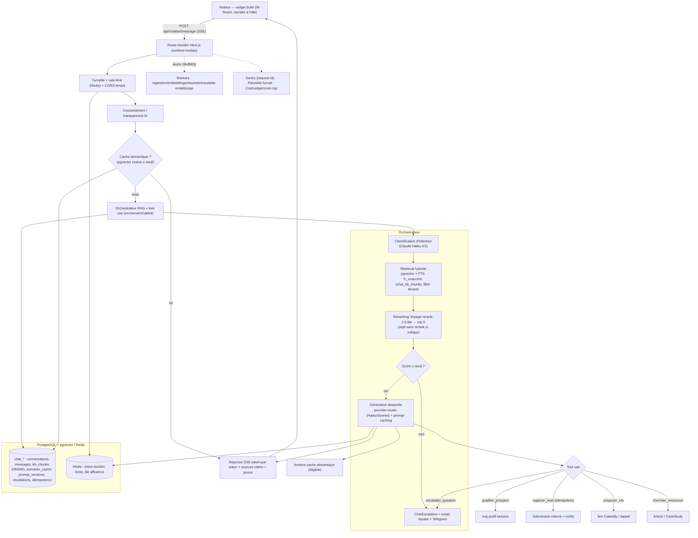

# Cahier des charges — Chatbot Axion-IA — **v4.0** (stack réelle)

**Projet :** Assistant conversationnel textuel pour axion-ia.com (et services futurs type Ulixai).
**Version :** 4.0 — recréée pour la **stack réelle** (Next.js 16 / TypeScript / Prisma / pgvector / BullMQ / Coolify), dérivée du v3.0 + addendum v3.1.
**Type :** Chatbot textuel, RAG + tool use, module **cloisonné dans le monorepo** Axion-IA.
**Stack cible :** Next.js 16.2.6 (route handlers Node runtime) · React 19 · PostgreSQL 16 **+ pgvector (déjà actif)** · Redis + **BullMQ** · API LLM provider-agnostic (**Anthropic Haiku/Sonnet + OpenAI** ; Voyage embeddings/rerank ; Gemini extensible mais **non utilisé au MVP**) · Cloudflare (CDN/Turnstile) · Hetzner CPX32.
**Base :** voir `02-AUDIT-DEPOT-REEL.md` (faits) et `03-ADR-DECISIONS-INGENIERIE.md` (décisions).

> **Changement majeur vs v3.0 :** la stack n'est PAS Laravel/Filament/Horizon mais Next.js/TypeScript/BullMQ. Les concepts (RAG, tool use, multi-tenant, cache sémantique, concurrence, garde-fous, RGPD, console, éval) sont conservés ; leur **implémentation** est réconciliée avec le code réel, dont une grande partie existe déjà.

---

## Table de correspondance v3.0 → v4.0

| Section v3.0 | Statut v4.0 | Décision / remplacement |
|---|---|---|
| §1 Contexte/objectifs | **Conservé** | Inchangé (concepts indép.) |
| §2 Périmètre | **Conservé** + précision | MVP **single-tenant** (Axion-IA), multi-tenant conçu mais activé phase ultérieure |
| §3 Personas/cas d'usage | **Conservé** | KB existante couvre TPE/PME/ETI |
| §4 Architecture RAG | **Recréé** | Orchestrateur TS (route handlers) ; voir diagramme §A4 |
| §5 Déploiement découplé (repo séparé) | **Recréé** | Module cloisonné monorepo (ADR-CB-01) ; isolation logique, pas repo séparé |
| §6 Multi-tenant | **Conservé** | `tenant_id` partout (Prisma) ; MVP 1 tenant |
| §7 Concurrence/charge (Horizon/Octane/autoscaling) | **Recréé** | BullMQ (≠ Horizon), Node SSE (≠ Octane), **scale vertical** mono-instance + container dédié si besoin (≠ autoscaling horizontal) |
| §8 Knowledge | **Conservé** + précision | Amorçage sur `KnowledgeEntry`/KbFact/pages services |
| §9 Pipeline ingestion | **Recréé** | Workers BullMQ `chatbot-ingest-*` |
| §10 Pipeline exécution | **Recréé** | TS orchestrateur ; classification/rerank via provider-router |
| §11 Cache sémantique | **Conservé** | pgvector + invalidation par version (ADR-CB-05) |
| §12 Contexte long | **Conservé** | Résumé via modèle léger |
| §13 Schéma SQL | **Recréé** | **Prisma `chat_*`** + chunks dédiés + vector(1024) (ADR-CB-03) |
| §14 Outils | **Conservé** + recâblage | `capturer_lead`→Submission ; `proposer_rdv`→**Calendly** (≠ cal.com) |
| §15 System prompt | **Conservé** + réutilisation | Réutilise `brand-voice.ts` (persona Manon) + prompt caching |
| §16 Anti-hallucination | **Conservé** | 4 couches ; citations + seuil + escalade |
| §17 Mode dégradé | **Conservé** | Réutilise fail-soft + circuit breaker existants |
| §18 RGPD/sécurité/anti-abus | **Conservé** + réutilisation | gdpr-export/erase, Turnstile, rate-limit, IP hash existants |
| §19 Versioning/backup/monitoring | **Conservé** | Sentry + `KnowledgeVersion` + backups Coolify→B2 |
| §20 Tests de charge | **Conservé** | k6, cible ≥200 à valider sur CPX32 |
| §21 Frontend/widget | **Recréé** | Île React idle (MVP) (ADR-CB-08) |
| §22 Backend | **Recréé** | Route handlers Node + services TS (≠ Laravel) |
| §23 Intégrations | **Recréé** | CRM interne, Calendly, **Plausible (≠ GA4)**, email worker, Telegram |
| §24 Console (Filament) | **Recréé** | Section admin Next existant (≠ Filament) (ADR-CB-07) |
| §25 Éval | **Conservé** | ~50 Q/R + Vitest + couplage versioning |
| §26 Garde-fous coût | **Conservé** + réutilisation | `cost-tracker`/cost-cap existant, cap tenant chatbot |
| §27 KPIs | **Conservé** | Instrumentés via Plausible + Sentry + métriques DB |
| §28 Stack | **Recréé** | Voir §H ci-dessous |
| §29 Roadmap MVP | **Conservé** + remappé | Mappée sur CI/CD réel (doc 05) |
| §30 Recette | **Conservé** + adapté | DoD doc 07 |

**Sections modifiées/recréées :** 4, 5, 7, 9, 10, 13, 21, 22, 23, 24, 28.
**Sections conservées (indép. stack) :** 1, 2, 3, 6, 8, 11, 12, 14 (concept), 15, 16, 17, 18, 19, 20, 25, 26, 27, 30.
**Sections supprimées :** aucune (toutes réconciliées). **Ajoutées :** §A4 diagramme, transparence AI Act explicite dans le widget (§F), sécurité IA anti-injection (renvoi doc 08).

---

# PARTIE A — CADRAGE & ARCHITECTURE

## A1. Objectifs (inchangés)
Exactitude ≥ 95 %, 0 hallucination, conversion ≥ 15 %, 1er token < 1,5 s / réponse < 6 s, uptime 99,5 %, cible **≥ 200 conversations simultanées** (à valider, R-CONC).

## A2. Périmètre v4.0
**Inclus MVP :** widget bulle ; RAG (retrieval hybride pgvector+FTS) ; qualification non-intrusive ; RDV Calendly ; capture lead (Submission interne) ; escalade email+Telegram ; mode dégradé ; cache sémantique ; haute concurrence (token-bucket) ; analytics Plausible ; console admin ; **FR uniquement** ; transparence AI Act.
**Conçu mais différé :** multi-tenant réel (Ulixai), bundle widget standalone CDN.
**Exclus :** voix, multilingue, WhatsApp/Messenger, live handoff (phase ultérieure).

## A3. Multi-tenant
`tenant_id` sur toutes les tables `chat_*` et tout le retrieval. MVP : un tenant `axion-ia` seedé. Le widget transmet une clé de tenant ; le serveur résout et **injecte** `tenant_id` (jamais de confiance au client).

## A4. Architecture & flux complet (diagramme)

# PARTIE B — DONNÉES & PIPELINES

## B1. Knowledge & ingestion
- Sources prioritaires : prestations, tarifs, FAQ (critiques) ; méthodo, cas clients (hautes) ; spécificités cibles, légal (moyennes) ; articles SEO (basse).
- **Amorçage** : `KnowledgeEntry`/`KnowledgeTranslation` + KbFacts TS + pages services canoniques (`/audit`, `/interventions`, `/implementation`, `/un-a-un`, `/sites-web-augmentes`).
- **Chunking** sémantique 300–600 tokens, chevauchement ~15 %, **contextualisation** (phrase de contexte préfixée). FR-only.
- **Embeddings** Voyage `voyage-3-lite` (1024) → `chat_kb_chunks.embedding` + `tsv` (fr_unaccent). Asynchrone (worker BullMQ).
- **Versioning** : version de knowledge incrémentée à chaque ré-ingestion → invalide le cache sémantique concerné.

## B2. Pipeline d'exécution (temps réel)
1. Turnstile + rate-limit + CORS tenant.
2. **Cache sémantique** : hit → réponse immédiate.
3. **Classification d'intention** (modèle léger).
4. **Retrieval hybride** pgvector + FTS, filtré métadonnées + `tenant_id`, top-k 20.
5. **Reranking** Voyage → top 5 (repli sans rerank).
6. **Vérification de confiance** : score < seuil → escalade (pas de réponse inventée).
7. **Régulation LLM** (token-bucket / backpressure).
8. **Génération** streamée (provider-router, prompt caching) + tool use.
9. Écriture cache sémantique (éligible).
**Split modèles** : léger (classification/résumé) / fort (génération).

## B3. Cache sémantique, contexte long, schéma
- Cache : ADR-CB-05. Contexte long : N derniers messages + résumé (`chat_conversations.resume`).
- Schéma : ADR-CB-03 (Prisma `chat_*`, HNSW + GIN via `migrations_fts`).

# PARTIE C — INTELLIGENCE

## C1. Outils (5) — recâblés
- `qualifier_prospect` (type_structure, secteur, besoin, maturite_ia, urgence) → `chat_conversations`/profil.
- `capturer_lead` (nom, email, telephone, structure, besoin_resume, **consentement_rgpd**) → **`Submission`** interne, **idempotent** (`chat_action_idempotency`). `tenant_id` serveur.
- `proposer_rdv` (type_rdv) → lien **Calendly** / `/appel`.
- `chercher_ressource` (sujet, type) → `Article`/`CaseStudy`.
- `escalader_question` (question, contexte, contact_email) → `ChatEscalation` + email équipe + Telegram + trou de KB en console. **Ne jamais inventer.**

## C2. System prompt & anti-hallucination
- System prompt **versionné par tenant** (`chat_prompt_versions`), **mis en cache** (prompt caching Anthropic).
- Réutilise **`brand-voice.ts`** (persona Manon : pro, pédagogue, chaleureux, vouvoiement, jamais insistant) + mots bannis. Curseur de conversion réglable (`ChatTenant.reglages`).
- 4 couches anti-hallucination : prompt (interdiction d'inventer) + seuil RAG + escalade structurée + observabilité (citations rendent les erreurs détectables). Détail sécurité IA : doc 08.

# PARTIE D — ROBUSTESSE & CHARGE
Mode dégradé (timeout/affluence/panne reranker/CRM → jamais d'erreur brute), circuit breakers (provider-router), token-bucket + backpressure, Sentry, tests de charge k6 (cible ≥200, à valider). Voir doc 02 §8 + doc 07 R-CONC.

# PARTIE E — SÉCURITÉ, RGPD, IA ACT
RGPD (consentement, conservation configurable + purge, DPA, effacement, UE), anti-abus (Turnstile + rate-limit), sécurité IA (anti-injection/jailbreak/exfiltration), transparence AI Act. Détail : doc 08.

# PARTIE F — FRONTEND / WIDGET
ADR-CB-08 : bulle bas-droite, île React idle, hors First Load JS, CLS 0, plein écran mobile, streaming token-par-token, chips, sources citées, pouce, indicateur frappe, persistance session serveur, reconnexion auto, états d'erreur sans perte de saisie, **mention « vous dialoguez avec une IA »**, WCAG AA, `prefers-reduced-motion`.

# PARTIE G — PILOTAGE
Console admin Next (ADR-CB-07), éval ~50 Q/R, garde-fous coût (cost-cap), KPIs via Plausible+Sentry+métriques DB. Détail doc 05.

# PARTIE H — STACK v4.0

| Couche | Technologie réelle | Remplace (v3.0) |
|---|---|---|
| Front widget | React 19 (île montée à l'idle, chunk async) | React CDN bundle |
| Backend | **Next.js 16 route handlers (Node runtime) + services TS** | Laravel 12 |
| Admin | **Admin Next maison (RBAC/2FA)** | Filament v4 |
| File/cache | **Redis + BullMQ** | Redis + Horizon |
| Base | **PostgreSQL 16 + pgvector (déjà actif)** | idem (Prisma) |
| Recherche | pgvector HNSW + tsvector fr_unaccent | idem |
| Embeddings | **Voyage voyage-3-lite (managé)** | Voyage/OpenAI auto-héb. |
| Reranking | **Voyage rerank-2.5-lite (managé)** | Cohere/Voyage |
| LLM | **provider-router (Anthropic Haiku/Sonnet + OpenAI), cheap-first** ; Gemini extensible non-MVP | API Anthropic |
| RDV | **Calendly Embed JS** | cal.com |
| CRM | **Submission/SubmissionReply (interne)** | Axion CRM Pro (Laravel) |
| Analytics | **Plausible + Clarity** | GA4/GTM |
| Edge/sécu | Cloudflare (CDN, Turnstile, WAF) | idem |
| Monitoring | Sentry + Telegram hub | Sentry |
| Hébergement | Hetzner CPX32 (UE) — scale vertical | Hetzner (autoscaling) |

*Fin du cahier v4.0.*
