# Phase 1.S — Annexe C — Matrice de cohérence inter-skills

> Read-only audit · 06/05/2026
> Périmètre : 18 skills `axionia-*` + 20 skills génériques pertinents.
> Source de vérité ultime : `axionia-package/docs/_DECISIONS-FINALES.md` puis `axionia-core`.

## 1. Légende

| Symbole | Sens                                                                           |
| :-----: | ------------------------------------------------------------------------------ |
|   ✅    | Complémentaires — chacun a son périmètre clair                                 |
|   🔁    | Redondants — la règle vit dans les deux skills · à dédupliquer (canon désigné) |
|   ⚠️    | Chevauchement — préciser qui prime + l'écrire dans les deux SKILL.md           |
|   ❌    | Contradictoires — résolution immédiate (canon = `axionia-core`)                |
|    ·    | Aucune interaction directe                                                     |

## 2. Matrice 38×38 (extraits actionnables)

La matrice complète serait illisible. On documente seulement les **paires non-vides** identifiées dans le périmètre. Toutes les paires non listées sont implicitement `·`.

### 2.1 Bloc UI / Design

| Paire                                                 | État | Canon désigné                                                                                                                                                                                | Note                                                                                                                                                                                                                                                                                                                                                                                                            |
| ----------------------------------------------------- | :--: | -------------------------------------------------------------------------------------------------------------------------------------------------------------------------------------------- | --------------------------------------------------------------------------------------------------------------------------------------------------------------------------------------------------------------------------------------------------------------------------------------------------------------------------------------------------------------------------------------------------------------- |
| `axionia-design` ↔ `axionia-core`                     |  ✅  | core (règles non-négociables) puis design (exécution Webflow-inspired)                                                                                                                       | core renvoie déjà vers design pour le détail                                                                                                                                                                                                                                                                                                                                                                    |
| `axionia-design` ↔ `web-design-guidelines`            |  ⚠️  | **axionia-design** prime sur direction visuelle, palette, gradients (bannis), shadows, radius                                                                                                | `web-design-guidelines` = linter UI/a11y/perf complémentaire (Vercel Labs, ~100 règles) — ses règles génériques sur `border-radius`, `box-shadow`, `gradient` peuvent contredire la doctrine Webflow-inspired (4-8px radius, shadow 5-couches, pas de gradient). **À écrire dans la description de `web-design-guidelines`** : « Sur AxionIA, voir `axionia-design` pour les overrides de direction visuelle ». |
| `axionia-design` ↔ `ui-ux-pro-max`                    |  ⚠️  | **axionia-design** prime                                                                                                                                                                     | core l'écrit déjà (ligne 160). `ui-ux-pro-max` propose 50 styles dont glassmorphism / claymorphism / brutalism / neumorphism / bento — **TOUS bannis** par axionia-design. Utilisable uniquement pour : font pairings (à filtrer pour rester sur Manrope+Inconsolata), spacing, contrastes.                                                                                                                     |
| `axionia-design` ↔ `frontend-design` (Anthropic Labs) |  ⚠️  | **axionia-design** prime                                                                                                                                                                     | core l'écrit déjà (ligne 161). `frontend-design` pousse une « bold aesthetic direction » qui peut entrer en conflit avec sobriété B2B. **Utilisable** pour : qualité d'exécution typographique, micro-interactions, refinement. **PAS utilisable** pour : direction visuelle globale, gradients, glassmorphism, brutalism.                                                                                      |
| `axionia-design` ↔ `axionia-mobile-first`             |  ⚠️  | **axionia-mobile-first** prime sur convention bottom-up Tailwind, viewports, touch targets. **axionia-design** prime sur tokens visuels (radius, shadow, palette) et patterns Boutons/Cards. | **Doublon à neutraliser** : la règle « touch targets 44×44 » est citée dans `axionia-design` (ligne 295), `axionia-mobile-first`, `axionia-a11y` — **canon unique = `axionia-a11y`** (WCAG 2.2 AA). Les deux autres doivent renvoyer vers a11y, pas reformuler.                                                                                                                                                 |
| `axionia-design` ↔ `axionia-a11y`                     |  ⚠️  | **axionia-a11y** prime sur focus, contrast, ARIA, touch targets, prefers-reduced-motion · **axionia-design** prime sur la couleur de l'anneau focus (Webflow Blue)                           | À aligner : axionia-design dit « anneau primary 2px », a11y doit confirmer.                                                                                                                                                                                                                                                                                                                                     |
| `axionia-design` ↔ `axionia-anti-spa`                 |  ✅  | anti-spa (architecture rendu) + design (style)                                                                                                                                               | Pas de chevauchement réel.                                                                                                                                                                                                                                                                                                                                                                                      |
| `axionia-mobile-first` ↔ `axionia-a11y`               |  🔁  | **axionia-a11y** sur touch targets / focus                                                                                                                                                   | Mobile-first dit déjà « 44×44 et espacement 8px » — c'est dupliqué.                                                                                                                                                                                                                                                                                                                                             |
| `axionia-mobile-first` ↔ `axionia-performance`        |  🔁  | **axionia-performance** est canon sur LCP/INP/CLS budgets                                                                                                                                    | Mobile-first reproduit les chiffres (LCP < 1.8s, INP < 80ms, CLS < 0.05). À fusionner — perf reste le canon, mobile-first renvoie.                                                                                                                                                                                                                                                                              |

### 2.2 Bloc SEO / AEO / Schema

| Paire                                     | État  | Canon désigné                                                                                                                | Note                                                                                                                                                                                                            |
| ----------------------------------------- | :---: | ---------------------------------------------------------------------------------------------------------------------------- | --------------------------------------------------------------------------------------------------------------------------------------------------------------------------------------------------------------- |
| `axionia-seo-aeo` ↔ `axionia-core`        |  ✅   | core (lexique « formation » banni, OÜ estonienne) puis seo-aeo (exécution)                                                   | OK                                                                                                                                                                                                              |
| `axionia-seo-aeo` ↔ `seo-audit-marketing` |  ⚠️   | **axionia-seo-aeo** prime sur scope projet                                                                                   | Le générique ne sait pas que `formation` est banni, ni que la société est OÜ estonienne, ni les pathnames `/fr/...` `/en/...`. **Action F** : neutraliser `seo-audit-marketing` au profit de `axionia-seo-aeo`. |
| `axionia-seo-aeo` ↔ `ai-seo`              |  ⚠️   | **axionia-seo-aeo** prime · `ai-seo` utilisable pour techniques GEO génériques (citations LLM, AI Overviews)                 | À cadenasser : `ai-seo` doit savoir que le mot « formation » est banni dans les llms.txt.                                                                                                                       |
| `axionia-seo-aeo` ↔ `schema-markup`       |  ⚠️   | **axionia-seo-aeo** prime sur schemas localisés FR/EN AxionIA · `schema-markup` utilisable pour génération générique JSON-LD | À aligner : seo-aeo doit pointer vers schema-markup pour le détail JSON-LD.                                                                                                                                     |
| `axionia-seo-aeo` ↔ `seo-schema`          |  🔁   | **`schema-markup` ou `seo-schema` (un seul)**                                                                                | Doublon entre 2 skills génériques sur le même sujet → choisir `schema-markup` (description plus claire), désactiver `seo-schema`.                                                                               |
| `axionia-seo-aeo` ↔ `seo-page`            |  ✅   | `seo-page` = analyse single URL, complémentaire                                                                              | OK avec note overrides AxionIA dans seo-page.                                                                                                                                                                   |
| `axionia-seo-aeo` ↔ `seo-drift`           |  ✅   | `seo-drift` = baseline/diff post-déploiement                                                                                 | OK.                                                                                                                                                                                                             |
| `axionia-seo-aeo` ↔ `seo-google`          |  ✅   | `seo-google` = APIs Search Console / GA4 organic — outil terrain                                                             | OK, à intégrer côté monitoring.                                                                                                                                                                                 |
| `axionia-seo-aeo` ↔ `seo-hreflang`        | ❌→⚠️ | **axionia-i18n** prime sur génération hreflang AxionIA · `seo-hreflang` = audit/validation                                   | À **écrire dans les deux** : hreflang est généré par `axionia-i18n` (next-intl + sitemap), `seo-hreflang` n'est qu'un validateur post-implémentation.                                                           |
| `axionia-seo-aeo` ↔ `seo-sitemap`         |  ⚠️   | **axionia-seo-aeo** définit la structure sitemap multilingue AxionIA · `seo-sitemap` = générateur générique                  | Note dans seo-sitemap : sur AxionIA on utilise la structure multi-fichier décrite dans seo-aeo.                                                                                                                 |
| `axionia-i18n` ↔ `seo-hreflang`           |  ⚠️   | **axionia-i18n** prime sur génération · `seo-hreflang` valide                                                                | Cf. ci-dessus.                                                                                                                                                                                                  |

### 2.3 Bloc Marketing / CRO / Copy

| Paire                                                                                | État  | Canon désigné                                                                                                                | Note                                                                                                                                                 |
| ------------------------------------------------------------------------------------ | :---: | ---------------------------------------------------------------------------------------------------------------------------- | ---------------------------------------------------------------------------------------------------------------------------------------------------- |
| `axionia-core` ↔ `copywriting`                                                       | ❌→⚠️ | **axionia-core** prime · le mot `formation` est banni · interventions/audit/implémentation est le lexique                    | `copywriting` ne sait pas. Cadenasser via note dans description.                                                                                     |
| `axionia-core` ↔ `cold-email`                                                        | ❌→⚠️ | **axionia-core** prime · `axionia-emails` doit prendre le relais sur tooling                                                 | `cold-email` peut conseiller Resend/SendGrid → INTERDIT.                                                                                             |
| `axionia-emails` ↔ `email-sequence`                                                  | ❌→⚠️ | **axionia-emails** prime sur tooling (PowerMTA + MailWizz + Nodemailer) · `email-sequence` utilisable pour stratégie/contenu | Le générique suppose un ESP type Resend par défaut → INTERDIT.                                                                                       |
| `axionia-emails` ↔ `cold-email`                                                      | ❌→⚠️ | **axionia-emails** prime sur tooling                                                                                         | Idem. AxionIA n'a pas de stratégie outbound massive en phase 1 — cold-email à désactiver projet-level.                                               |
| `axionia-forms` ↔ `form-cro`                                                         |  ⚠️   | **axionia-forms** prime sur stack (RHF+Zod+Zustand+shadcn) · `form-cro` utilisable pour patterns de friction et copy         | À cadenasser : form-cro peut suggérer du JS client lourd qui contredit `axionia-anti-spa`.                                                           |
| `axionia-forms` ↔ `signup-flow-cro`                                                  |   ·   | **N/A AxionIA**                                                                                                              | Pas de signup utilisateur en phase 1. À désactiver.                                                                                                  |
| `axionia-forms` ↔ `popup-cro`                                                        |  ⚠️   | **axionia-anti-spa** + **axionia-design** priment                                                                            | Les popups exit-intent sont JS-client → s'assurer que ça ne casse pas SSR/SEO. Glassmorphism modal banni par axionia-design.                         |
| `axionia-anti-spa` ↔ `page-cro`                                                      |  ⚠️   | **axionia-anti-spa** prime                                                                                                   | `page-cro` peut pousser des A/B tests JS client, des hero animés lourds, etc. → respecter SSR/SSG natif.                                             |
| `axionia-anti-spa` ↔ `popup-cro` / `form-cro` / `signup-flow-cro` / `email-sequence` |  ⚠️   | **axionia-anti-spa** prime                                                                                                   | Tout pattern « client-side first » est INTERDIT s'il dégrade SEO/AEO.                                                                                |
| `axionia-stack` ↔ `copywriting` / `cold-email` / `email-sequence`                    | ❌→⚠️ | **axionia-stack** prime                                                                                                      | Stack verrouillée : Resend/SendGrid/Mailgun/Brevo INTERDITS, Vercel/AWS/GCP/Render INTERDITS. Tout skill générique qui les suggère doit être ignoré. |
| `axionia-seo-aeo` ↔ `copywriting` / `page-cro`                                       |  ⚠️   | **axionia-seo-aeo** prime sur lexique + bloc AEO 50-80 mots                                                                  | Page-cro peut proposer des hero sans bloc AEO → à intégrer.                                                                                          |

### 2.4 Bloc Database / Backend

| Paire                                               | État | Canon désigné                                                                                                        | Note                                         |
| --------------------------------------------------- | :--: | -------------------------------------------------------------------------------------------------------------------- | -------------------------------------------- |
| `axionia-database` ↔ `axionia-stack`                |  ✅  | stack (choix Postgres/Prisma) puis database (schémas)                                                                | OK, pas de doublon.                          |
| `axionia-database` ↔ futur `axionia-content-models` |  ⚠️  | **À créer** (Annexe F) · ce skill formaliserait les modèles content (articles, FAQ, case-studies) sortis de database | Aujourd'hui database porte tout — surcharge. |

### 2.5 Bloc Sécurité / Déploiement / Monitoring

| Paire                                                | État | Canon désigné                                                                                                                                        | Note                                                                                                                                                           |
| ---------------------------------------------------- | :--: | ---------------------------------------------------------------------------------------------------------------------------------------------------- | -------------------------------------------------------------------------------------------------------------------------------------------------------------- |
| `owasp-security` ↔ `axionia-deployment`              |  ⚠️  | **axionia-deployment** prime sur headers HTTP CSP/HSTS/X-Frame réels (Coolify + Cloudflare) · `owasp-security` = checklist OWASP Top 10 conceptuelle | À écrire dans les deux : `axionia-deployment` est canon sur les valeurs effectives, `owasp-security` est canon sur la doctrine (auth, input validation, CSRF). |
| `owasp-security` ↔ `axionia-rgpd`                    |  ✅  | rgpd (cadre légal UE) + owasp (sécurité technique)                                                                                                   | Pas de chevauchement.                                                                                                                                          |
| `axionia-monitoring` ↔ `axionia-deployment`          |  ⚠️  | **axionia-monitoring** prime sur Sentry + Uptime Kuma + Pino · **axionia-deployment** prime sur l'INSTALLATION (docker-compose) de ces outils        | À expliciter : install dans deployment, config & alertes dans monitoring.                                                                                      |
| `axionia-monitoring` ↔ futur `axionia-observability` |  🔁  | **garder `axionia-monitoring`**, ne pas créer `axionia-observability`                                                                                | Annexe F : `axionia-monitoring` couvre déjà observability (Sentry traces, Pino logs, Uptime Kuma, Plausible). Renommer/clarifier au lieu de doublonner.        |

### 2.6 Bloc Performance

| Paire                                                 | État | Canon désigné                                            | Note                                             |
| ----------------------------------------------------- | :--: | -------------------------------------------------------- | ------------------------------------------------ |
| `axionia-performance` ↔ `axionia-mobile-first`        |  🔁  | **axionia-performance** est canon (chiffres LCP/INP/CLS) | mobile-first reproduit. À déduplicater.          |
| `axionia-performance` ↔ `axionia-seo-aeo`             |  🔁  | **axionia-performance** est canon                        | seo-aeo reproduit (LCP < 1.8s etc.). À renvoyer. |
| `axionia-performance` ↔ `seo-google` (PageSpeed/CrUX) |  ✅  | perf (budgets) + seo-google (mesure terrain)             | OK.                                              |

### 2.7 Bloc Process / Méta

| Paire                                                                    | État | Canon désigné                                                                                                                                                                              | Note                                                                                                            |
| ------------------------------------------------------------------------ | :--: | ------------------------------------------------------------------------------------------------------------------------------------------------------------------------------------------ | --------------------------------------------------------------------------------------------------------------- |
| `brainstorming` / `writing-plans` / `executing-plans` ↔ ce prompt-maître |  ⚠️  | **prompt-maître Phase 1.S → ... → Phase N** prime sur cadence                                                                                                                              | Ces skills proposent leurs propres structures — à invoquer **sous** la cadence du prompt-maître, pas l'inverse. |
| `subagent-driven-development` ↔ `executing-plans`                        |  ✅  | exécutables en parallèle                                                                                                                                                                   | OK.                                                                                                             |
| `test-driven-development` ↔ `axionia-testing`                            |  ⚠️  | **axionia-testing** prime sur les patterns Vitest+Playwright spécifiques AxionIA (RHF, Server Actions, axe-core, fixtures FR/EN) · `test-driven-development` = méthode rouge-vert-refactor | À écrire dans TDD : « pour AxionIA voir `axionia-testing` pour stack et fixtures ».                             |
| `verification-before-completion` ↔ `axionia-testing`                     |  ✅  | verification (méthode) + testing (stack)                                                                                                                                                   | OK.                                                                                                             |
| `systematic-debugging` ↔ tout                                            |  ✅  | Méthodo générique invocable partout                                                                                                                                                        | OK.                                                                                                             |

## 3. Diagramme Mermaid des dépendances clés

```mermaid
graph TD
  CORE[axionia-core] --> DESIGN[axionia-design]
  CORE --> STACK[axionia-stack]
  CORE --> SEO[axionia-seo-aeo]
  CORE --> EMAILS[axionia-emails]
  CORE --> RGPD[axionia-rgpd]

  DESIGN --> A11Y[axionia-a11y]
  DESIGN --> MOBILE[axionia-mobile-first]
  DESIGN --> ANTISPA[axionia-anti-spa]

  STACK --> DB[axionia-database]
  STACK --> DEPLOY[axionia-deployment]
  DEPLOY --> MONITOR[axionia-monitoring]

  SEO --> I18N[axionia-i18n]
  SEO --> ANTISPA
  PERF[axionia-performance] -.canon.-> MOBILE
  PERF -.canon.-> SEO

  DESIGN -. prime sur .-> WDG[web-design-guidelines]
  DESIGN -. prime sur .-> UIUX[ui-ux-pro-max]
  DESIGN -. prime sur .-> FED[frontend-design]

  SEO -. prime sur .-> SEOAUD[seo-audit-marketing]
  SEO -. prime sur .-> AISEO[ai-seo]
  SEO -. prime sur .-> SCHEMA[schema-markup]

  EMAILS -. prime sur .-> EMSEQ[email-sequence]
  EMAILS -. prime sur .-> COLD[cold-email]

  STACK -. prime sur .-> COPY[copywriting]
  ANTISPA -. prime sur .-> PCRO[page-cro]
  ANTISPA -. prime sur .-> POPUP[popup-cro]

  TESTING[axionia-testing] -. prime sur .-> TDD[test-driven-development]

  classDef axn fill:#146ef5,stroke:#0055d4,color:#fff
  classDef gen fill:#f3f4f6,stroke:#9ca3af,color:#111
  class CORE,DESIGN,STACK,SEO,EMAILS,RGPD,A11Y,MOBILE,ANTISPA,DB,DEPLOY,MONITOR,I18N,PERF,TESTING axn
  class WDG,UIUX,FED,SEOAUD,AISEO,SCHEMA,EMSEQ,COLD,COPY,PCRO,POPUP,TDD gen
```

## 4. Contradictions critiques à résoudre

Source de vérité : `_DECISIONS-FINALES.md` puis `axionia-core`. Les contradictions ci-dessous sont **bloquantes** avant Phase 2.

### C-01 — Hreflang : qui prime sur la génération ?

- **Symptôme** : `axionia-i18n` génère hreflang via next-intl ; `seo-hreflang` propose son propre validateur ; `axionia-seo-aeo` parle aussi de hreflang.
- **Résolution** : canon unique = `axionia-i18n` pour la **génération** ; `seo-hreflang` réservé à la **validation post-build** ; `axionia-seo-aeo` renvoie vers `axionia-i18n` sur ce point.

### C-02 — Touch targets 44×44 : 3 sources

- **Symptôme** : règle citée dans `axionia-design` (l. 295), `axionia-mobile-first`, `axionia-a11y`.
- **Résolution** : canon = `axionia-a11y` (WCAG 2.2 AA). Les deux autres renvoient avec un lien (« voir axionia-a11y §2 »).

### C-03 — Perf budgets : 3 sources qui répètent les chiffres

- **Symptôme** : LCP < 1.8s · INP < 80ms · CLS < 0.05 cités dans `axionia-performance`, `axionia-mobile-first`, `axionia-seo-aeo`, `CLAUDE.md §8`, `_DECISIONS-FINALES.md`.
- **Résolution** : canon code = `axionia-performance` ; les autres renvoient. Le canon documentaire reste `_DECISIONS-FINALES.md`.

### C-04 — `frontend-design` vs `axionia-design` : direction visuelle

- **Symptôme** : `frontend-design` (Anthropic Labs) pousse « bold aesthetic, distinctive, avoid generic AI » → peut suggérer brutalism/maximalism qui contredisent la doctrine Webflow-inspired sobre.
- **Résolution** : description de `frontend-design` à ne PAS modifier (skill externe), mais `axionia-core` doit déjà l'écrire (déjà fait, lignes 161 et 165-169). À renforcer dans le routing.

### C-05 — `ui-ux-pro-max` propose 50 styles dont glassmorphism / brutalism

- **Symptôme** : sa description liste explicitement « glassmorphism, claymorphism, brutalism, neumorphism, bento grid » → tous bannis par `axionia-design` (lignes 433-434).
- **Résolution** : `axionia-core` l'écrit déjà — renforcer en Annexe F (cadenas dans description ou désactivation projet).

### C-06 — Email tooling : Resend vs PowerMTA

- **Symptôme** : `email-sequence` et `cold-email` génériques supposent un ESP type Resend/SendGrid/Mailchimp ; `_DECISIONS-FINALES.md` et `axionia-emails` interdisent formellement ces ESP.
- **Résolution** : canon = `axionia-emails`. Cadenas description sur les deux génériques.

### C-07 — Lexique « formation »

- **Symptôme** : `copywriting`, `page-cro`, `seo-audit-marketing`, `ai-seo`, `schema-markup`, `seo-content`, `seo-page` peuvent générer du contenu avec le mot « formation » (mot très courant en B2B).
- **Résolution** : canon = `axionia-core` §1. Tous les skills génériques invoqués sur du contenu AxionIA doivent passer par un linter post-traitement (grep `formation|formateur|former|formé`) — à automatiser dans Phase 2 via hook.

### C-08 — Schema dupliqué

- **Symptôme** : 2 skills génériques font le même travail : `schema-markup` (description claire) et `seo-schema` (description sèche). Plus `axionia-seo-aeo` qui définit déjà les schemas AxionIA.
- **Résolution** : garder `schema-markup` (génération générique JSON-LD), désactiver `seo-schema` (Annexe F), `axionia-seo-aeo` reste canon sur les schemas localisés FR/EN AxionIA.

### C-09 — Headers de sécurité (CSP, HSTS, X-Frame)

- **Symptôme** : `owasp-security` propose une checklist générique ; `axionia-deployment` configure réellement Coolify + Cloudflare.
- **Résolution** : `axionia-deployment` canon sur la **valeur effective** ; `owasp-security` canon sur la **doctrine** (CSP doit être présent, pas wildcard, etc.). À écrire dans les deux.

### C-10 — Patterns Vitest/Playwright spécifiques

- **Symptôme** : `test-driven-development` propose une méthode rouge-vert-refactor générique ; `axionia-testing` impose Vitest + Playwright + axe-core + fixtures FR/EN + mocks Telegram/PowerMTA.
- **Résolution** : `axionia-testing` canon sur stack ; TDD canon sur méthode. Cohabitation simple, à écrire dans les deux.

### C-11 — Calendrier

- **Symptôme** : aucun skill générique ne couvre Calendly. Mais le mot « calendrier » dans des skills CRO peut amener à proposer Calendly (banni).
- **Résolution** : canon = `axionia-calendar` (calendrier maison 3 états). À mentionner dans `axionia-core` les skills CRO susceptibles de proposer Calendly. (Faible risque.)

### C-12 — Future skill `axionia-observability` ?

- **Symptôme** : prompt-maître Phase 1.S §7 mentionne « peut être déjà couvert par `axionia-monitoring` ».
- **Résolution** : NE PAS créer un doublon. Garder `axionia-monitoring` qui couvre déjà tout (Sentry, Uptime, Pino, Plausible, sauvegardes). Renforcer la description.

## 5. Synthèse priorisée

|         Priorité          | Action                                                                                                                                                             | Skills concernés |
| :-----------------------: | ------------------------------------------------------------------------------------------------------------------------------------------------------------------ | ---------------- |
| **P0** (bloquant Phase 2) | Cadenasser `email-sequence`, `cold-email` (canon `axionia-emails`)                                                                                                 | C-06             |
|          **P0**           | Cadenasser `copywriting`, `page-cro`, `seo-audit-marketing` (lexique « formation »)                                                                                | C-07             |
|          **P0**           | Désactiver `seo-schema` (doublon `schema-markup`)                                                                                                                  | C-08             |
|          **P0**           | Désactiver `signup-flow-cro`, `paywall-upgrade-cro`, `onboarding-cro`, `churn-prevention`, `revops`, `community-marketing`, `referral-program` (hors scope projet) | Annexe F         |
|          **P1**           | Dédupliquer touch targets (canon a11y)                                                                                                                             | C-02             |
|          **P1**           | Dédupliquer perf budgets (canon `axionia-performance`)                                                                                                             | C-03             |
|          **P1**           | Clarifier hreflang : génération=i18n / validation=seo-hreflang                                                                                                     | C-01             |
|          **P1**           | Clarifier headers sécurité : doctrine=owasp / valeurs=deployment                                                                                                   | C-09             |
|          **P2**           | Ajouter notes overrides dans `web-design-guidelines`, `ui-ux-pro-max`, `frontend-design`                                                                           | C-04, C-05       |
|          **P2**           | Ajouter note overrides dans `test-driven-development`                                                                                                              | C-10             |
|          **P3**           | Harmoniser ton/structure des SKILL.md `axionia-*`                                                                                                                  | tous             |

## 6. Règle de précédence officielle (à inscrire dans `axionia-core`, nulle part ailleurs)

1. `_DECISIONS-FINALES.md` > tout
2. `axionia-core` > tous les autres skills
3. `axionia-*` > skills génériques sur tout sujet projet
4. Skills génériques utilisés uniquement pour leur spécialité hors AxionIA-specific
5. En cas de conflit non résolu → STOP & ASK Will

(Cette règle figure ailleurs aujourd'hui — CLAUDE.md, ADR — mais n'est pas formellement déclarée canonique dans `axionia-core`. Ajouter une section unique en tête de `axionia-core`.)
