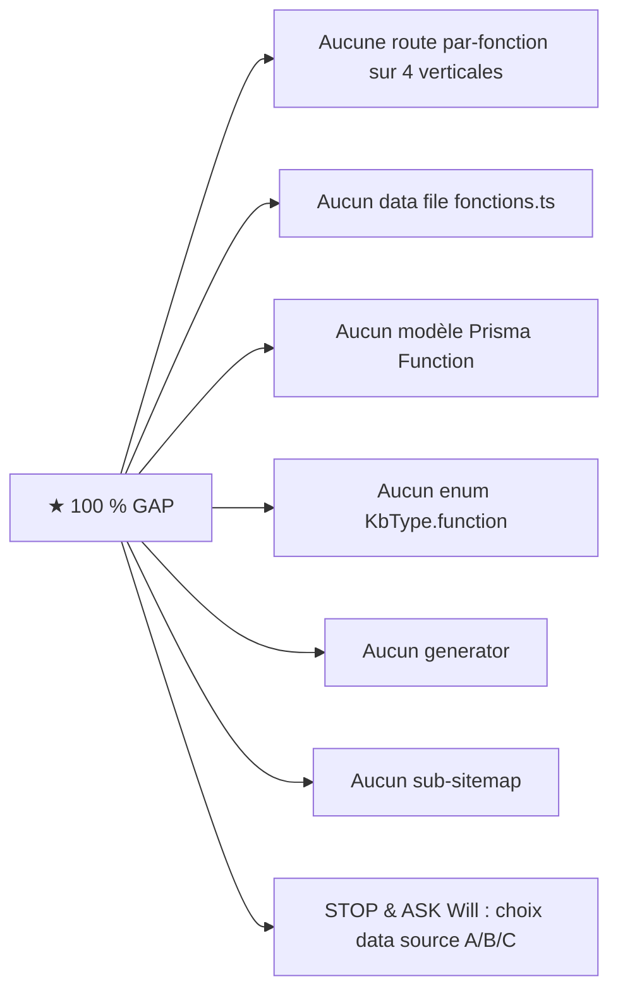

# 04 — FLOW MASTER MERMAID — Vue d'ensemble + 12 types

> Diagrammes Mermaid synthétiques. Détail par type dans `12-TYPE-*.md` à `23-TYPE-*.md`.
> Lecture pour Will : suivre les flèches comme une recette de cuisine.

---

## 0. Flow master — Vue d'ensemble plateforme content-gen

```mermaid
flowchart TB
    subgraph "Sources d'entrée"
        ADMIN[Will / Admin briefing<br/>/content-gen/orchestrator]
        RSS[Sources RSS externes<br/>ContentGenConfig.rss_sources]
        KBSRC[Sitemaps externes<br/>KB ingest URLs]
        MANUAL[Data files manuels<br/>src/content/*.ts]
    end

    subgraph "Workers BullMQ (15+)"
        ORCH[content-orchestrator-worker]
        GENW[content-gen-worker<br/>déléguation generator]
        RSSW[content-rss-fetch-worker]
        FACTW[content-fact-check-worker]
        QAW[content-qa-extract-worker]
        SIMW[content-similarity-monitor-worker]
        PUBW[content-publish-worker<br/>★ chokepoint DB+IndexNow]
        QUALW[content-quality-improver-worker]
        TIERW[content-tier-lifecycle-worker]
        NEWSW[content-news-lifecycle-worker<br/>tombstone 48h]
        IDXW[content-indexnow-worker]
        GIDXW[content-google-indexing-worker]
        KWSW[content-keyword-sync-worker<br/>GSC shadow]
        MONW[content-monitoring-worker]
        PSIW[content-psi-monitor-worker]
        WVW[content-web-vitals-monitor-worker<br/>p75 CrUX]
        RETW[retention-purge-worker<br/>GL 12m / cost 24m / vitals 6m]
    end

    subgraph "11 Generators"
        G1[blog-article]
        G2[blog-from-keywords]
        G3[blog-from-title]
        G4[blog-from-rss]
        G5[guide-pilier]
        G6[comparison]
        G7[faq-standalone]
        G8[qa-derived]
        G9[landing-ville]
        G10[landing-ville-templates helper]
        G11[types helper]
    end

    subgraph "Quality gates (ordre)"
        QG1[doctrine-check<br/>banned phrases]
        QG2[plagiarism check]
        QG3[readability score]
        QG4[search-intent-validator]
        QG5[seo-score]
        QG6[soft-404-gate<br/>350 mots min]
        QG7[topic-fingerprint dedup<br/>Hamming ≤8 block]
        QG8[embedding-similarity]
        QG9[fact-check claims]
    end

    subgraph "Postgres 16"
        ART[(Article + Translation<br/>+ SlugHistory + Tag)]
        FAQ[(FAQ)]
        KB[(KnowledgeEntry<br/>+ 19 sub-tables KB V4)]
        CS[(CaseStudy fichier statique)]
        HELP[(HelpArticle + Translation)]
        GL[(GenerationLog<br/>append-only)]
        AUD[(ContentGenAuditLog<br/>SOC2 P1-9)]
        CL[(CostLedger<br/>per provider call)]
        WVS[(WebVitalSample<br/>p75 CrUX)]
        RQ[(ReviewQueue)]
        CGJ[(ContentGenJob)]
    end

    subgraph "Discovery & Indexation"
        ROBOTS[/robots.txt<br/>14 AI bots allow + 4 disallow/]
        SIDX[/sitemap-index.xml<br/>15-17 sub-sitemaps/]
        SNEWS[/sitemap-news.xml<br/>48h glissante max 1000 URLs/]
        LLMS[/llms.txt v0.2<br/>+ llms-full.txt/]
        AITXT[/ai.txt Spawning.ai/]
        SECTXT[/.well-known/security.txt<br/>RFC 9116/]
        INDEXNOW[IndexNow ping<br/>Bing+Yandex+Seznam]
        GSC[GSC URL Indexing API]
    end

    subgraph "Frontend public"
        BLOG[/blog + /blog/slug/]
        VILLES[/audit + /interventions + /implementation + /un-a-un<br/>par-ville/slug × 4 verticales]
        FAQPUB[/faq + /faq/slug]
        KBPUB[/connaissances]
        CSPUB[/cas-concrets + /cas-concrets/slug]
        HELPPUB[/centre-aide + /centre-aide/slug]
        IMPL[/implantations/region + /region/ville]
    end

    subgraph "Approval workflow Will"
        REVIEW[/admin/.../content-gen/review-queue<br/>★ Will approve manually]
    end

    ADMIN --> ORCH
    RSS --> RSSW
    KBSRC --> KB
    MANUAL --> CS

    ORCH --> CGJ
    CGJ --> GENW
    GENW --> G1 & G2 & G3 & G5 & G6 & G7 & G8 & G9
    RSSW --> G4
    G4 --> GENW

    G1 & G2 & G3 & G4 & G5 & G6 & G7 & G8 & G9 --> QG1
    QG1 --> QG2 --> QG3 --> QG4 --> QG5 --> QG6 --> QG7 --> QG8 --> QG9

    QG9 --> RQ
    RQ --> REVIEW
    REVIEW -->|approve| PUBW
    PUBW --> ART
    PUBW --> FAQ
    PUBW --> IDXW & GIDXW
    IDXW --> INDEXNOW
    GIDXW --> GSC

    ART --> BLOG & VILLES
    FAQ --> FAQPUB
    KB --> KBPUB
    CS --> CSPUB
    HELP --> HELPPUB

    BLOG & VILLES & FAQPUB & KBPUB & CSPUB & HELPPUB --> SIDX
    SIDX --> ROBOTS
    SNEWS --> ROBOTS

    PUBW -.->|log| GL
    PUBW -.->|cost| CL
    Will[Will] -.->|toggle| AUD

    GENW -.->|kill-switch| ORCH

    QAW -.->|extract Q/R| FAQ
    SIMW -.->|MinHash dedup| ART

    NEWSW -.->|tombstone 48h| SNEWS
    TIERW -.->|tier downgrade| ART
    QUALW -.->|re-gen tier3→tier1| ART
    KWSW -.->|GSC keywords| AUD
    WVW -.->|alerts Telegram| WVS

    RETW -.->|purge| GL & CL & WVS

    classDef external fill:#fce4ec
    classDef worker fill:#e3f2fd
    classDef gen fill:#fff3e0
    classDef gate fill:#f3e5f5
    classDef db fill:#e8f5e9
    classDef discovery fill:#fff9c4
    classDef pub fill:#e0f7fa
    classDef will fill:#ffebee,stroke:#d32f2f,stroke-width:3px

    class ADMIN,RSS,KBSRC,MANUAL external
    class ORCH,GENW,RSSW,FACTW,QAW,SIMW,PUBW,QUALW,TIERW,NEWSW,IDXW,GIDXW,KWSW,MONW,PSIW,WVW,RETW worker
    class G1,G2,G3,G4,G5,G6,G7,G8,G9,G10,G11 gen
    class QG1,QG2,QG3,QG4,QG5,QG6,QG7,QG8,QG9 gate
    class ART,FAQ,KB,CS,HELP,GL,AUD,CL,WVS,RQ,CGJ db
    class ROBOTS,SIDX,SNEWS,LLMS,AITXT,SECTXT,INDEXNOW,GSC discovery
    class BLOG,VILLES,FAQPUB,KBPUB,CSPUB,HELPPUB,IMPL pub
    class REVIEW,Will will
```

---

## 1. Flow type 1 — Articles blog factory

```mermaid
flowchart LR
  A[Admin orchestrator briefing<br/>keyword + intent + audience] --> B[ContentGenJob]
  B --> C[content-gen-worker]
  C --> D{generator}
  D -->|blog_article| E1[blog-article.ts ★ STUB délégué]
  D -->|blog_keywords| E2[blog-from-keywords.ts ★ STUB]
  D -->|guide_pilier| E3[guide-pilier.ts<br/>2-step outline+sections]
  E1 & E2 & E3 --> F[Quality gates 9 étapes]
  F --> G[ReviewQueue pending_review]
  G --> H{Will approve ?}
  H -->|✅| I[content-publish-worker]
  H -->|❌| J[tier_3_noindex + Sentry alert]
  I --> K[(Article + Translation FR)]
  I --> L[IndexNow ping Bing+Yandex]
  I --> M[GSC submit URL]
  K --> N[/blog/slug rendu]
  K --> O[sitemap-blog inclusion]
```

---

## 2. Flow type 2 — Actualités RSS

```mermaid
flowchart LR
  A[ContentGenConfig.rss_sources<br/>JSON inline, pas de table RssSource] --> B[content-rss-fetch-worker<br/>cron horaire]
  B --> C[Parser regex naïf<br/>★ ne supporte PAS Atom 1.0]
  C --> D[content-gen-worker job<br/>blog_from_rss]
  D --> E[blog-from-rss.ts ★ STUB délégué]
  E --> F[Quality gates]
  F --> G[ReviewQueue]
  G --> H[content-publish-worker]
  H --> I[(Article isNews=true)]
  H --> J[IndexNow + GSC]
  I --> K[/blog/slug]
  I --> L[sitemap-news.xml<br/>48h glissante max 1000 URLs<br/>xmlns:news Google News]
  I --> M[content-news-lifecycle-worker<br/>★ tombstone après 48h ★]
  M --> N[tombstone meta noindex<br/>+ retire sitemap-news]
```

---

## 3. Flow type 3 — Landing pages ville × 4 verticales

```mermaid
flowchart TB
  A[Admin /content-gen/geo/villeSlug/generate<br/>OU batches /geo/batches/new] --> B[ContentGenJob landing_ville]
  B --> C[content-gen-worker]
  C --> D[landing-ville.ts generator]
  D --> E{variant 4}
  E --> F1[default]
  E --> F2[focus_audit]
  E --> F3[focus_interventions]
  E --> F4[focus_implementation]
  E -.->|S+3 reco| F5[focus_dirigeants un-a-un]
  F1 & F2 & F3 & F4 --> G[soft-404-gate<br/>★ 350 mots min<br/>tolerance 280 si LocalBusiness JSON-LD + cas + FAQ≥4]
  G -->|< seuil| H[tier_3_noindex_nofollow]
  G -->|≥ seuil| I[quality gates restantes]
  I --> J[ReviewQueue]
  J -->|Will approve| K[content-publish-worker]
  K --> L[(Article + ArticleTranslation FR<br/>mentionedCities[] populés)]
  K --> M[par-ville/slug 4 routes :<br/>audit, interventions, implementation, un-a-un]
  L --> N[Hub ville /implantations/region/ville<br/>★ getBlogArticlesByVille à câbler P1]
  L --> O[Sitemap services-villes-verticale]
  L --> P[IndexNow + GSC]
```

---

## 4. Flow type 4 — KB entries (Knowledge Base V4)

```mermaid
flowchart LR
  A[Sitemap externe URL] --> B[kb-ingest/sitemap-parser.ts]
  B --> C[robots-respect.ts<br/>SSRF-safe fetch]
  C --> D[url-extractor.ts]
  D --> E[kb-feeder.ts publishToKB]
  E --> F[(KnowledgeEntry status=published)]
  F -.->|stubbed V1| G[Voyage AI embeddings]
  G -.-> H[(KnowledgeEmbedding<br/>★ stubbed)]
  F --> I[/connaissances rendu public<br/>audience=public uniquement]
  F --> J[Sitemap knowledge-N chunks]
  E --> K[(KnowledgeAuditLog)]
  E --> L[(KnowledgeIngestRequest)]
  F -.->|lookup RAG| M[kb-client.ts<br/>FTS fallback mode]
  M -.->|consumed by| N[Generators content-gen RAG retrieve]
```

---

## 5. Flow type 5 — Cas concrets

```mermaid
flowchart LR
  A[Will édite src/content/case-studies.ts] --> B[5 fixtures manuelles<br/>★ TODO Sprint 15 Prisma migration]
  B --> C[/cas-concrets/page.tsx liste]
  B --> D[/cas-concrets/slug détail]
  C --> E[sitemap-pages inclusion]
  B -.->|champ geo absent ★ bug P1| F[getNearbyCases vide silencieux]
  F -.->|hub villes pSEO| G[bandeau cas vide]
  B --> H[Phase F fallback Sprint S+2<br/>getNearbyCasesWithFallback<br/>proximity→région→secteur→none]
  H --> I[/audit/par-ville/slug<br/>bandeau cas concrets local]
```

---

## 6. Flow type 6 — FAQ items

```mermaid
flowchart LR
  A1[Generator faq-standalone ★ STUB] --> B[content-publish-worker]
  A2[Generator qa-derived ★ STUB] --> B
  A3[content-qa-extract-worker<br/>★ post-process auto réel] --> C[(FAQ row tier_2_noindex_follow par défaut)]
  C --> D[/faq/page.tsx liste]
  C --> E[/faq/slug détail]
  C --> F[★ Sitemap V1 BUG :<br/>buildFaqSitemap expose FAQ_GLOBAL legacy uniquement<br/>FAQ DB tier_1 absentes]
  C --> G[JSON-LD FAQPage + Speakable]
  C -.->|workflow batch admin à créer| H[promote tier_1]
```

---

## 7. Flow type 7 — Comparaisons & Guides piliers

```mermaid
flowchart LR
  A1[3 entrées éditoriales statiques<br/>src/content/comparaisons.ts] --> B1[/comparaisons/page.tsx]
  A2[comparison.ts generator ★ STUB délégué landing-ville] --> X[★ orphelin]
  A3[guide-pilier.ts<br/>2-step outline + N sections] --> C[Quality gates]
  C --> D[(Article templateVariant=guide-pilier)]
  D --> E[★ /guides/page.tsx INEXISTANT<br/>★ pathname /guides absent routing.ts<br/>★ guides factory orphelins]
  D --> F[/blog/slug rendu fallback]
```

---

## 8. Flow type 8 — Pages presse (newsroom)

```mermaid
flowchart LR
  A[Will édite src/content/press.ts] --> B[/presse/page.tsx unique]
  B --> C[JSON-LD WebPage + NewsroomPage Speakable]
  B --> D[JSON-LD FAQPage]
  B --> E[JSON-LD Person]
  B --> F[JSON-LD ItemList NewsArticle]
  A --> G[PressImageBank.tsx embed image-bank]
  B --> H[★ Sitemap-news.xml IGNORE press.ts<br/>(lit DB Article only)]
  B --> I[★ /presse/slug INEXISTANT<br/>communiqués sans URL canonique]
```

---

## 9. Flow type 9 — Stack IA outils

```mermaid
flowchart LR
  A[Doctrine 11 outils / 5 catégories<br/>STACK_CATEGORIES + STACK_TOOLS] --> B[/stack-ia/page.tsx]
  B --> C[JSON-LD ItemList SoftwareApplication × 11]
  B --> D[JSON-LD FAQPage]
  B --> E[★ /stack-ia/tool/page.tsx INEXISTANT<br/>pas de Product schema détaillé<br/>pas de mesh /comparaisons]
  B --> F[Combos matrice hardcodés inline<br/>drift risk]
```

---

## 10. Flow type 10 — Par-fonction (catalogue)



---

## 11. Flow type 11 — Glossaire IA

```mermaid
flowchart LR
  A[Reader unifié DB/hardcode<br/>src/lib/knowledge/readers.ts<br/>flag KB_BACKEND_UNIFIED_GLOSSARY] --> B[/glossaire/page.tsx<br/>12 termes]
  B --> C[JSON-LD DefinedTermSet]
  B --> D[★ /glossaire/slug INEXISTANT<br/>handicap AEO/GEO -30 % citabilité]
  B --> E[★ aucun mesh entrant<br/>blog/KB/cas → terme]
```

---

## 12. Flow type 12 — Centre d'aide

```mermaid
flowchart LR
  A[Admin /admin/.../help/list new edit] --> B[(HelpArticle + Translation<br/>Prisma actif)]
  B -.->|★ silencieux : admin DB ≠ public hardcode| C[Public lit HELP_ARTICLES src/content/transversal.ts]
  C --> D[/centre-aide/page.tsx]
  C --> E[/centre-aide/slug détail]
  C --> F[/centre-aide/categorie/slug]
  D & E & F --> G[hreflang + JSON-LD Article + TL;DR AnswerCard + AiContentDisclaimer]
  E --> H[/api/markdown/centre-aide/slug<br/>alternate markdown]
  B -.->|★ reader unifié à créer<br/>pattern glossaire à répliquer| I[P0 productivité interne]
```

---

## Légende couleurs

- 🟢 fond clair = production-ready
- ★ = anomalie identifiée (cf. fichier de type ou cross-check)
- pointillés = lien optionnel ou observabilité

---

**Fin 04-FLOW-MASTER-MERMAID.md.**
