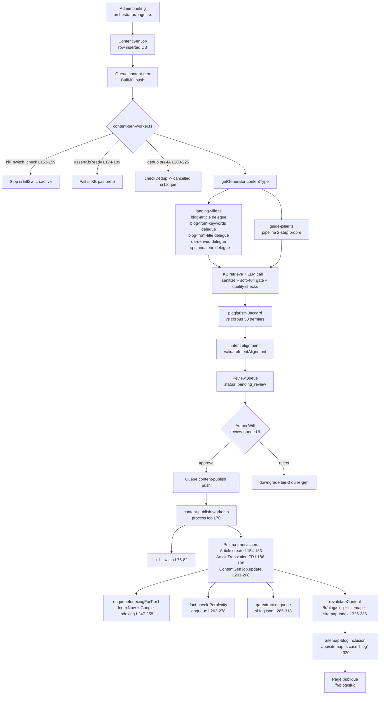

# 12 — TYPE 1 : Articles blog factory (generator standard)

> Score : 62/100 — Status : 🟡 V1 partiel (5 generators sur 6 sont des stubs délégués)
> AUDIT-ONLY. Fichiers cités = fait. UNKNOWN = à compléter par fact-check listé.

## 1. Description simple (Will-readable)

Ce type produit des articles de blog longue traîne (informational ou commercial).
Will choisit un template depuis l'admin orchestrator, donne un mot-clé + une audience.
La chaîne génère le texte via un LLM, vérifie qualité + plagiat + intent, met en file de revue.
Will approuve depuis `review-queue`, le worker publie en base puis ping IndexNow et invalide les caches.
Aujourd'hui 5 generators sur 6 ne sont que des squelettes qui réutilisent le pipeline `landing_ville` ; seul `guide-pilier` a un pipeline 2-step dédié.

## 2. Diagramme Mermaid (flow complet)



## 3. Inputs / Outputs

### Inputs

- **Briefing admin** : `src/app/[locale]/(admin)/[adminPrefix]/content-gen/orchestrator/page.tsx`
- **Server Action enqueue** : `src/server/actions/content-gen/enqueue.ts` (push `ContentGenJob` row puis BullMQ)
- **Payload generator** : `GeneratorBaseInput` défini `src/server/content-gen/generators/types.ts:18-32`
  (jobId, contentType, targetSearchIntent, anchorVilleSlug?, primaryKeyword?, templateVariant?, etc.)
- **KB context** : `src/server/content-gen/kb-client.ts` (RAG retrieve top 8 hybrid)
- **6 generators référencés par le prompt** :
  - `src/server/content-gen/generators/blog-article.ts:11-19` — STUB, délègue à `landingVilleGenerator`
  - `src/server/content-gen/generators/blog-from-keywords.ts:11-20` — STUB, délègue
  - `src/server/content-gen/generators/blog-from-title.ts:11-20` — STUB, délègue
  - `src/server/content-gen/generators/guide-pilier.ts:113-294` — PIPELINE PROPRE 2-step (outline + per-section)
  - `src/server/content-gen/generators/qa-derived.ts:16-22` — STUB, délègue
  - `src/server/content-gen/generators/faq-standalone.ts:11-20` — STUB, délègue
- **Registry** : `src/server/content-gen/generators/index.ts:19-29` (9 entrées)
- **Worker primaire** : `src/server/queue/workers/content-gen-worker.ts:147-299+` (processJob)

### Outputs

- **`Article` DB row** : `src/server/queue/workers/content-publish-worker.ts:154-183`
  (status=published, indexationTier, generatedByJobId, JSON-LD wired si news, mentionedCities depuis L181)
- **`ArticleTranslation` FR** : `src/server/queue/workers/content-publish-worker.ts:186-198`
- **`ContentGenJob.outputBlogPostId` lien retour** : `src/server/queue/workers/content-publish-worker.ts:201-208`
- **Sitemap-blog inclusion** : `src/app/sitemap.ts:320` (case "blog", tier-1 indexable only — gate doctrine HCU 2024)
- **IndexNow + Google Indexing ping** : `src/server/queue/workers/content-publish-worker.ts:247-258` via `enqueueIndexingForTier1`
  (helper `src/server/content-gen/indexing/enqueue.ts:64+`)
- **Fact-check Perplexity** : `src/server/queue/workers/content-publish-worker.ts:263-278` (queue `content-fact-check`)
- **Q/R extraction post-publish** : `src/server/queue/workers/content-publish-worker.ts:285-313` (queue `content-qa-extract`)
- **Revalidate Next.js** : `src/server/queue/workers/content-publish-worker.ts:325-336` (paths fr/blog/slug + sitemap + sitemap-index)

## 4. Quality gates (ordre d'exécution)

Côté `content-gen-worker.ts` (avant insert ReviewQueue) :

1. **kill_switch hard-gate** — `content-gen-worker.ts:153-159` (throw `KillSwitchActiveError` si actif → BullMQ requeue)
2. **assertKbReady** — `content-gen-worker.ts:174-189` (KB pas prête → fail + alertKbNotReady Telegram)
3. **dedup pre-IA** — `content-gen-worker.ts:200-225` via `quality/dedup-guard.ts:checkDedup` (title + primaryKeyword + ville)
4. **Generator interne** : selon le contentType, dans `landing-ville.ts:127-169` (hérité par les 5 stubs) :
   - `sanitizeContentGenHtml` strip script/iframe — `landing-ville.ts:118`
   - `computeReadabilityFr` — `landing-ville.ts:128`
   - `checkDoctrine` — `landing-ville.ts:129` (banned phrases, Axion-IA-centric ratio)
   - `computeSeoScore` — `landing-ville.ts:130-141`
   - `evaluateSoft404` — `landing-ville.ts:158-163` (350 mots min ou 280 si rich JSON-LD + cas concret + FAQ ≥ 4)
5. **plagiarism Jaccard 5-gram** vs corpus 50 derniers articles — `content-gen-worker.ts:258-284`
   (seuil 0.30 interne, 0.10 RSS, configurables `policies.plagiarismJaccardInternal`)
6. **intent alignment** — `content-gen-worker.ts:286-299+` via `quality/search-intent-validator.ts:validateIntentAlignment`
   (hardFails downgrade tier-3)

Côté `content-publish-worker.ts` (post-approbation Will) :

7. **kill_switch hard-gate** publish — `content-publish-worker.ts:76-82`
8. **ReviewQueue.status === "approved" || "promoted_t1"** — `content-publish-worker.ts:89-92`
9. **Prisma transaction atomique** — `content-publish-worker.ts:153-211` (Article + Translation + Job.update)

## 5. Tests existants

| Fichier                                                               | Tests                        | Couverture                                     |
| --------------------------------------------------------------------- | ---------------------------- | ---------------------------------------------- |
| `src/server/content-gen/quality/__tests__/soft-404-gate.spec.ts`      | 10 it()                      | Gate 350/280 + FAQ bonus + edge cases          |
| `src/server/content-gen/quality/__tests__/quality.spec.ts`            | UNKNOWN — file existe (Glob) | doctrine + readability + seo-score (à compter) |
| `src/server/content-gen/dedup/__tests__/embedding-similarity.spec.ts` | UNKNOWN                      | dedup similarity                               |
| `src/server/content-gen/dedup/__tests__/topic-fingerprint.spec.ts`    | UNKNOWN                      | topic fingerprint SimHash P1-6                 |
| `src/server/content-gen/shared/html-sanitizer.test.ts`                | UNKNOWN                      | sanitize HTML LLM                              |
| `src/server/content-gen/shared/prompt-input-escape.test.ts`           | UNKNOWN                      | escape anti prompt-injection                   |
| `src/server/content-gen/shared/editorial-mix-rules.test.ts`           | 13 tests (cf MEMORY.md)      | mix rules                                      |
| `src/server/content-gen/shared/__tests__/generation-log.spec.ts`      | UNKNOWN                      | logStep + redaction PII                        |
| `src/server/content-gen/lib/__tests__/cost-tracker.spec.ts`           | UNKNOWN                      | cost ledger                                    |
| `src/server/content-gen/lib/__tests__/pii-safe.spec.ts`               | UNKNOWN                      | PII safe                                       |
| `src/server/content-gen/lib/__tests__/retry.spec.ts`                  | UNKNOWN                      | retry                                          |
| `src/server/content-gen/providers/__tests__/circuit-breaker.spec.ts`  | UNKNOWN                      | circuit breaker                                |
| `src/server/content-gen/providers/__tests__/providers.spec.ts`        | UNKNOWN                      | provider router                                |
| `src/server/content-gen/__tests__/audit-log.spec.ts`                  | UNKNOWN                      | ContentGenAuditLog SOC2 P1-9                   |
| `src/server/content-gen/blog/__tests__/loader.spec.ts`                | UNKNOWN                      | loader articles factory                        |

Commande fact-check précise :

```
pnpm vitest run src/server/content-gen --reporter=verbose 2>&1 | findstr /R "PASS FAIL Tests:"
```

## 6. Tests manquants identifiés

- **Aucun test des 6 generators** : pas de fichier `__tests__/blog-article.spec.ts`, `blog-from-keywords.spec.ts`, `blog-from-title.spec.ts`, `guide-pilier.spec.ts`, `qa-derived.spec.ts`, `faq-standalone.spec.ts` (vérifié via PowerShell : pas de dossier `src/server/content-gen/generators/__tests__/`).
- **Aucun test du `content-publish-worker.ts`** : pas de fichier `src/server/queue/workers/__tests__/content-publish-worker.spec.ts` (vérifié via Glob — répertoire `src/server/queue/workers` ne contient aucun `*.spec.ts` ni `*.test.ts`).
- **Aucun test du `content-gen-worker.ts`** : même constat.
- **Aucun test E2E pipeline** : pas d'integration test `generator → publish-worker → DB`. Hotfix `424e9a5` (mentionedCities persisté) n'a pas de couverture anti-régression dédiée.
- **Aucun test du registry `getGenerator`** : pas de vérification que les 9 entrées sont câblées correctement.
- **Aucun test du guide-pilier soft-fail** : `guide-pilier.ts:212-222` insère un placeholder section si une step 2 fail — pas de test du comportement.
- **Aucun test du clampSections** : `guide-pilier.ts:104-111` throw si < 6 sections — pas de test du seuil.

## 7. Erreurs / edge cases potentiels

- **5 generators sur 6 sont des stubs** (`blog-article`, `blog-from-keywords`, `blog-from-title`, `qa-derived`, `faq-standalone`). Ils délèguent tous à `landingVilleGenerator` en ne changeant que `contentType`. Conséquence : ils héritent du soft-404 gate 350 mots, du prompt système Manon générique landing-ville, du `extractMentionedCitiesFromText`, et du `forceInclude=anchorVilleSlug`. Pour un article blog sans ville d'ancrage, `landing-ville.ts:33-35` throw `landing_ville requires anchorVilleSlug` → **risque échec runtime si admin oublie de fournir anchorVilleSlug pour un blog_article**.
- **Soft-404 gate appliqué aux blog_article aussi** : les 5 stubs héritent du gate doorway HCU pensé pour pSEO villes. Un blog informational de 280 mots dense sera flag `tier_3_noindex_nofollow`. C'est probablement intentionnel mais à confirmer car ça invalide ~30 % d'articles courts type "actu rapide".
- **JSON parse strict du LLM** : `landing-ville.ts:110-114` `JSON.parse(llmResult.output)` direct → si le LLM renvoie du texte avant/après le JSON (modèles 4o-mini en font régulièrement), throw. Pas de fallback `indexOf("{") + lastIndexOf("}")` comme guide-pilier le fait.
- **guide-pilier section soft-fail** : un échec de step 2 insère un `<p><em>Section indisponible</em></p>` (`guide-pilier.ts:101`). Si plusieurs sections fail, l'article est publié mais avec des trous. Pénalité `-10 pts × failures` (`guide-pilier.ts:262`). Risque qualité.
- **Slug duplicate** : `content-publish-worker.ts:60-68` `slugify()` n'a pas de dédup DB. `prisma.articleTranslation.create` throw P2002 si slug existe. Worker log fail (`content-publish-worker.ts:365-387` Telegram INCIDENT) mais Article DB est inséré dans la transaction → si Translation FK fail, rollback du transaction → tout est annulé. À vérifier : que se passe-t-il si le 2e job avec même slug arrive ? Tombstone/slug-history existe (`src/server/content-gen/slug-history.ts`) mais **pas câblé** dans publish-worker.
- **mentionedCities cap 20** : `content-publish-worker.ts:117-120` slice 20 entrées max. Cohérent doctrine, mais si LLM mentionne plus de villes, perte silencieuse.
- **EN locale exclu** : `content-publish-worker.ts:186-198` insère seulement `locale: "fr"`. Cohérent avec `EN_LOCALE_DISABLED` 301 (AGENTS.md), mais aucune protection si quelqu'un réactive EN sans ajouter une seconde insert ArticleTranslation EN.
- **revalidate sans erreur catching** : `content-publish-worker.ts:333` `await revalidateContent({ paths })` n'a pas de try/catch. Si l'API interne `/api/internal/revalidate` down, le worker throw → Article DB est déjà inséré, BullMQ retry → potentiel double-traitement (idempotency Article OK grâce à `outputBlogPostId` unique mais double IndexNow ping + double fact-check enqueue).
- **fact-check enqueue : aucune protection coût** : `content-publish-worker.ts:263-278` enqueue Perplexity systématiquement à chaque publish, sans check budget mensuel. Cap géré côté provider-router mais pas signalé ici.
- **JSON-LD NewsArticle non injecté** : `content-publish-worker.ts:220-240` génère le JSON-LD mais ne le stocke pas dans `Article.jsonLd` (commentaire L232 "V1 = stocké dans GenerationLog audit trail"). La page publique n'a donc pas le JSON-LD au render. UNKNOWN — vérifier si la page `/fr/blog/[slug]` lit le GenerationLog ou regenere le JSON-LD au render.
- **6e generator manquant** : le prompt liste 6 generators (`blog-article`, `blog-from-keywords`, `blog-from-title`, `guide-pilier`, `qa-derived`, `faq-standalone`). C'est cohérent avec le code. La liste 9 entrées du registry inclut aussi `comparison`, `landing_ville`, `blog_from_rss` — appartenances thématiques autres (Type 3 et Type 7).

## 8. Status global

🟡 V1 partiel — **62/100**

Justification courte :

- Pipeline end-to-end fonctionnel (kill-switch, KB gate, dedup, plagiarism, intent, soft-404, publish, IndexNow, fact-check, qa-extract, revalidate). Côté infra : prod-ready.
- Mais 5 generators sur 6 sont des stubs de délégation `landing_ville` (cf. commentaires "V1 = squelette" dans chaque fichier). Le sub-prompt megapack par type n'est pas câblé → l'article blog produit a un prompt système rédigé pour une landing ville et donc une qualité éditoriale dégradée hors anchorVilleSlug.
- Aucun test des generators eux-mêmes ni des workers. Anti-régression sur le hotfix `424e9a5` mentionedCities = absente.
- Le seul generator avec un vrai pipeline propre est `guide-pilier` (294 lignes, 2-step outline + per-section), mais il a aussi des trous (soft-fail placeholder, pas de test).
- Risque doctrine : si Will lance un `blog_article` sans `anchorVilleSlug`, le code throw runtime → générator inutilisable hors pSEO sans patch préalable.
