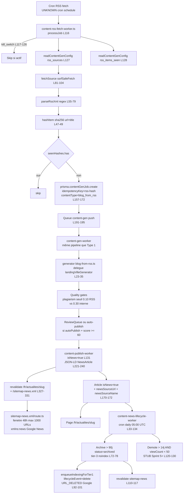

# 13 — TYPE 2 : Actualités RSS factory

> Score : 58/100 — Status : 🟡 V1 partiel (parser RSS regex naïf + storage transitoire dans ContentGenConfig + UNKNOWN sur cron RSS fetch + viewCount demote stub Sprint 5+)
> AUDIT-ONLY. Fichiers cités = fait. UNKNOWN = à compléter par fact-check listé.

## 1. Description simple (Will-readable)

Ce type lit en boucle les flux RSS configurés (médias IA, presse spécialisée).
Pour chaque nouvel article du flux, il crée un job de génération qui produit une actualité Axion-IA.
L'actualité est insérée en base avec un drapeau "news", apparaît dans `/fr/actualites` et dans `sitemap-news.xml` (fenêtre 48h glissante max 1000 URLs).
Après 90 jours l'article est archivé (status=archived, retiré du sitemap, ping `URL_DELETED` à Google).
Aujourd'hui le parser RSS est minimaliste (regex sans dépendance), les sources sont stockées dans une table générique `ContentGenConfig` (pas une table dédiée `RssSource`).

## 2. Diagramme Mermaid (flow complet)



## 3. Inputs / Outputs

### Inputs

- **Sources RSS** : stockées dans `ContentGenConfig` table avec key `rss_sources` — `content-rss-fetch-worker.ts:127`
  Schéma `RssSource` : `{ url, name, tags[], pollIntervalMin, autoPublish, enabled }` — `content-rss-fetch-worker.ts:31-38`
  - ⚠️ Le prompt mentionne « table RssSource Prisma » → **N'EXISTE PAS** comme table dédiée. Stockage en `ContentGenConfig.value` JSON (transitoire V1). Commentaire L13-14 : "V1.5 migrera vers table RssItem propre quand volume > 1000 items".
- **Admin UI gestion sources** : `src/app/[locale]/(admin)/[adminPrefix]/content-gen/rss/page.tsx` (+ `/rss/new`, `/rss/[id]`) — confirmé existant
- **Server Actions** : `src/server/actions/content-gen/rss.ts`
- **Cache items vus** : `ContentGenConfig` key `rss_items_seen` (cap 5000 hash entries LRU FIFO) — `content-rss-fetch-worker.ts:28-29, 200-203`
- **Hash dedup** : sha256(url + title) tronqué 16 chars — `content-rss-fetch-worker.ts:47-49`
- **Fetch sécurisé** : `ssrfSafeFetch` (anti SSRF OWASP A10, DNS lookup + IP privée refusée + redirects validés) — `content-rss-fetch-worker.ts:88-91`
- **Timeout fetch** : 30 s via AbortController — `content-rss-fetch-worker.ts:83-84`
- **Generator** : `src/server/content-gen/generators/blog-from-rss.ts:23-35` — STUB délègue `landingVilleGenerator`
- **Cron déclencheur** : **UNKNOWN — requires fact-check**
  Le worker n'expose pas le scheduler. Commande de résolution :
  ```
  Grep "content-rss-fetch" dans src/server/queue/ et scripts/ + src/instrumentation*.ts
  ```

### Outputs

- **`ContentGenJob` row** : `content-rss-fetch-worker.ts:157-172`
  (idempotencyKey=`rss-${hash}`, contentType=`blog_from_rss`, targetSearchIntent=`informational`, primaryProvider=`openai`, fallbackProvider=`anthropic`)
- **Queue push `content-gen`** : `content-rss-fetch-worker.ts:191-195` (jobId BullMQ = `gen-${contentGenJobId}` pour dédup)
- **Generator output enrichi JSON-LD NewsArticle** : `src/server/content-gen/generators/blog-from-rss.ts:43-75` `enrichOutputWithNewsArticleJsonLd` (factory `buildNewsArticleJsonLd`)
- **Article DB** : `content-publish-worker.ts:154-183` avec :
  - `isNews=true` — L170
  - `newsSourceUrl` — L171 (si rssLink string)
  - `newsSourceName` — L172
  - `templateVariant = cgJob.templateId` — L168
  - `searchIntent: cgJob.targetSearchIntent` — L169
  - Bloc JSON-LD NewsArticle généré (mais **non persisté** L222-240 — log only, `Article.jsonLd` non écrit)
- **Sitemap-news.xml** : `src/app/sitemap-news.xml/route.ts`
  - Cap dur 1000 URLs Google News — L33 `NEWS_SITEMAP_MAX_URLS = 1000`
  - Fenêtre stricte 48h — L35 `NEWS_FRESHNESS_WINDOW_MS = 48 * 60 * 60 * 1000`
  - Filtre : `status=published`, `isNews=true`, `indexationTier=tier_1_indexable`, `publishedAt >= cutoff` — L65-71
  - XML namespace `xmlns:news="http://www.google.com/schemas/sitemap-news/0.9"` — L116
  - Cache-Control 5 min + SWR 10 min + SIE 1 semaine — L124
- **Pages publiques** : `/fr/actualites` + `/fr/actualites/[slug]` (revalidate trigger `content-publish-worker.ts:326-327`)
- **Worker lifecycle** : `src/server/queue/workers/content-news-lifecycle-worker.ts`

## 4. Quality gates (ordre d'exécution)

1. **kill_switch RSS fetch** — `content-rss-fetch-worker.ts:117-126` (skip tick complet si actif, P1-7 fix audit op 2026-05-14)
2. **SSRF mitigation fetch source** — `content-rss-fetch-worker.ts:88-91` `ssrfSafeFetch` (refuse IP privées + DNS + redirects)
3. **Source `enabled=true`** — `content-rss-fetch-worker.ts:82`
4. **Timeout fetch 30 s** — `content-rss-fetch-worker.ts:83-84`
5. **Dedup par hash** — `content-rss-fetch-worker.ts:136-139`
6. **Idempotency Prisma `idempotencyKey` unique** — `content-rss-fetch-worker.ts:159` + race condition catch P2002 silent skip L176-179
7. **Cap seen cache 5000 entries LRU FIFO** — `content-rss-fetch-worker.ts:200-203`
8. **kill_switch content-gen-worker** — `content-gen-worker.ts:153-159` (avant lookup DB)
9. **Hard gate KB ready** — `content-gen-worker.ts:174-189`
10. **Dedup pre-IA** — `content-gen-worker.ts:200-225` (sur title)
11. **Generator + quality checks** (héritage `landingVilleGenerator`) :
    - Soft-404 350 mots — `landing-ville.ts:158-163`
    - Doctrine check — `landing-ville.ts:129`
    - SEO score — `landing-ville.ts:130-141`
    - Readability — `landing-ville.ts:128`
    - HTML sanitize — `landing-ville.ts:118`
12. **Plagiarism Jaccard seuil 0.10 RSS** (vs 0.30 interne) — `content-gen-worker.ts:261-265` (`plagiarismJaccardRss` policy)
13. **Intent alignment** — `content-gen-worker.ts:286-299+` (RSS = `informational` par défaut donc cohérent)
14. **Auto-publish RSS gate** : seuil score min 60 (`RSS_AUTOPUBLISH_MIN_SCORE_DEFAULT = 60` — `content-gen-worker.ts:65`) + flag `source.autoPublish=true` propagé via `inputPayload.autoPublish` (`content-rss-fetch-worker.ts:154`)
15. **kill_switch publish** — `content-publish-worker.ts:76-82`
16. **kill_switch news lifecycle** — `content-news-lifecycle-worker.ts:37-43`
17. **Lifecycle archive après 90j** — `content-news-lifecycle-worker.ts:56-67` + revalidate sitemap-news L110-117 + `enqueueIndexingForTier1` lifecycleEvent=delete L92-101
18. **Lifecycle demote après 14j + viewCount < 50** — **STUB Sprint 5+** — `content-news-lifecycle-worker.ts:120-130` (commentaire "besoin Plausible API sync")

## 5. Tests existants

| Fichier                                                          | Tests   | Couverture                                    |
| ---------------------------------------------------------------- | ------- | --------------------------------------------- |
| Aucun test du `content-rss-fetch-worker.ts`                      | 0       | parseRssXml, fetchSource, hashItem, dedup     |
| Aucun test du `content-news-lifecycle-worker.ts`                 | 0       | archive, demote, revalidate                   |
| Aucun test du `blog-from-rss.ts` generator                       | 0       | enrichOutputWithNewsArticleJsonLd, délégation |
| Aucun test du `sitemap-news.xml/route.ts`                        | 0       | fenêtre 48h, cap 1000, escapeXml, fail-soft   |
| `src/lib/seo-content-gen-factories.test.ts`                      | UNKNOWN | inclut peut-être `buildNewsArticleJsonLd`     |
| `src/lib/__tests__/seo-content-gen-factories.spec.ts`            | UNKNOWN | idem                                          |
| `src/server/content-gen/quality/__tests__/soft-404-gate.spec.ts` | 10 it() | hérité (gate s'applique aux RSS aussi)        |

Commande fact-check précise :

```
Grep "buildNewsArticleJsonLd|NewsArticle" dans src/lib/seo-content-gen-factories*.spec.ts
```

## 6. Tests manquants identifiés

- **Parser RSS regex** (`parseRssXml`) : aucun test malgré 25 lignes de regex. Doit tester :
  - CDATA wrapping `<![CDATA[...]]>`
  - Items multi-feed Atom vs RSS 2.0 (Atom utilise `<entry>` pas `<item>` → **non supporté actuellement**)
  - Caractères XML échappés
  - Items sans titre ou sans link (filter L70)
- **Fenêtre 48h glissante sitemap-news** : pas de test du `cutoff` (`sitemap-news.xml/route.ts:61`), pas de test du cap 1000 (L33), pas de test du `xmlns:news` (L116), pas de test escapeXml.
- **Cycle de vie complet** : pas d'integration test du flow `archive > 90j → sitemap retire → URL_DELETED Google ping`.
- **Idempotency RSS** : pas de test que 2 fetch successifs avec mêmes items ne créent pas 2 jobs (race condition `P2002` catch silent skip).
- **kill_switch effectif** : ni rss-fetch ni news-lifecycle ont un test de comportement quand killSwitch.active=true.
- **SSRF protection** : pas de test d'intégration `ssrfSafeFetch` sur une URL malveillante (192.168.x.x, 127.x.x.x, IPv6 link-local).
- **Auto-publish gate** : pas de test que `source.autoPublish=true` + score ≥ 60 publie tier-1 vs `< 60` part en review-queue.
- **`enrichOutputWithNewsArticleJsonLd`** : pas de test que tous les champs optionnels sont gérés correctement (heroImageUrl, dateline, printSection, wordCount, readingTimeMinutes).

## 7. Erreurs / edge cases potentiels

- **Parser RSS regex ne supporte PAS Atom 1.0** : `content-rss-fetch-worker.ts:57` `<item[^>]*>` cherche uniquement RSS 2.0. Les flux Atom (`<entry>`) seront ignorés silencieusement. Commentaire L53-54 reconnaît la limite ("V1.5 ajoutera `fast-xml-parser`").
- **Stockage `rss_sources` en ContentGenConfig** : transitoire V1 (commentaire L13). Risque : ContentGenConfig est une table key/value clé textuelle. Si Will configure 50 sources via admin, la value JSON peut dépasser plusieurs MB → coût lecture à chaque tick.
- **Cap LRU FIFO seen cache 5000** : `content-rss-fetch-worker.ts:200-203`. Si volume RSS > 5000 items en moins de 1h, les hash plus anciens sortent → risque dédoublonnage perdu (re-création jobs duplicates). Cap arbitraire sans monitoring.
- **Concurrency 1 serial** : `content-rss-fetch-worker.ts:218` (`concurrency: 1`) pour éviter spam sources tiers. Si Will ajoute 100 sources avec `pollIntervalMin=15`, le tick suivant ne peut pas commencer tant que le précédent n'a pas fini → backlog progressif.
- **Pas d'alerte Telegram sur fail RSS** : `content-rss-fetch-worker.ts:220-222` log console.error sans `alertIncident`. Si toutes les sources tombent en erreur, Will ne le sait pas.
- **Pas de circuit breaker par source** : si une source tombe en 500 récurrent, elle est re-tentée à chaque tick sans backoff exponentiel. SSRF safe fetch n'a pas de circuit breaker exposé.
- **`primaryProvider: "openai"` hardcodé** : `content-rss-fetch-worker.ts:169` ignore les `ProviderConfig` admin. Si Will a configuré Anthropic primary, le tick RSS force OpenAI.
- **Demote viewCount STUB** : `content-news-lifecycle-worker.ts:120-130`. Tier-2 demote ne se déclenche jamais en V1 (commentaire "Sprint 5+ Plausible sync"). Les articles RSS sous-perfomants restent tier-1 indexable indéfiniment jusqu'à 90j archive.
- **Archive batch 200 par tick** : `content-news-lifecycle-worker.ts:66` `take: 200`. Si Will publie 500 RSS/jour, le worker traite 200/jour en archive → backlog cumulé 300/jour. **Risque sitemap-news contenant des articles > 48h archivés silencieusement** (filtre `publishedAt >= cutoff` côté sitemap protège mais c'est un workaround).
- **isNews tier_1_indexable obligatoire pour sitemap-news** : `sitemap-news.xml/route.ts:65-71` filtre `indexationTier="tier_1_indexable"`. Si un RSS sort en tier-2 par défaut (score < seuil promote), il n'apparaît jamais dans sitemap-news → AEO/Google News rate.
- **JSON-LD NewsArticle non persisté Article.jsonLd** : `content-publish-worker.ts:222-240` génère le bloc et le log dans GenerationLog seulement (commentaire L232-233). La page `/fr/actualites/[slug]` doit donc re-générer le JSON-LD au render — **risque drift** entre généré au publish et rendu au runtime.
- **revalidatePath sans contexte worker** : `content-news-lifecycle-worker.ts:83-85, 110-117` `try/catch` swallow l'erreur "no-op si pas de request context". Le sitemap-news n'est donc PAS revalidé immédiatement après archive batch. Le hotfix P1-16 audit op 2026-05-14 (helper `revalidateContent` API interne) **n'est pas câblé ici** — incohérent avec `content-publish-worker.ts:325-336` qui lui l'utilise.
- **escapeXml insuffisant** : `sitemap-news.xml/route.ts:47-53` couvre `& < > " '` mais pas les caractères de contrôle (U+0000 à U+001F) qui invalident le XML Google News. Edge case rare mais possible si le LLM produit un titre avec un \x1F.
- **Cron schedule inconnu** : impossible de confirmer la fréquence du tick `content-rss-fetch`. UNKNOWN bloquant pour estimer coût mensuel + risque sur-fréquence (rate-limit médias tiers).

## 8. Status global

🟡 V1 partiel — **58/100**

Justification courte :

- Pipeline RSS bout-en-bout fonctionnel : ingestion + dedup + génération + publish + sitemap-news 48h + archive 90j + URL_DELETED Google.
- Mais beaucoup de stubs et hacks transitoires : parser regex naïf (pas Atom), storage `ContentGenConfig` au lieu de table `RssSource`, demote viewCount STUB (Sprint 5+), JSON-LD NewsArticle non persisté, cron inconnu.
- Aucun test des 4 fichiers critiques (rss-fetch-worker, news-lifecycle-worker, blog-from-rss generator, sitemap-news.xml/route.ts).
- Pas d'alerte Telegram sur fail RSS fetch ni sur backlog archive. Pas de circuit breaker par source.
- Cohérence des kill_switch OK (3 workers gardent le contrat).
- Spec Google News (xmlns:news + fenêtre 48h + cap 1000) bien implémentée côté route handler.
- Score limité par la combinaison : (a) generator stub délégué à landing-ville, (b) stockage transitoire ContentGenConfig, (c) absence totale de tests, (d) STUB demote Sprint 5+.
