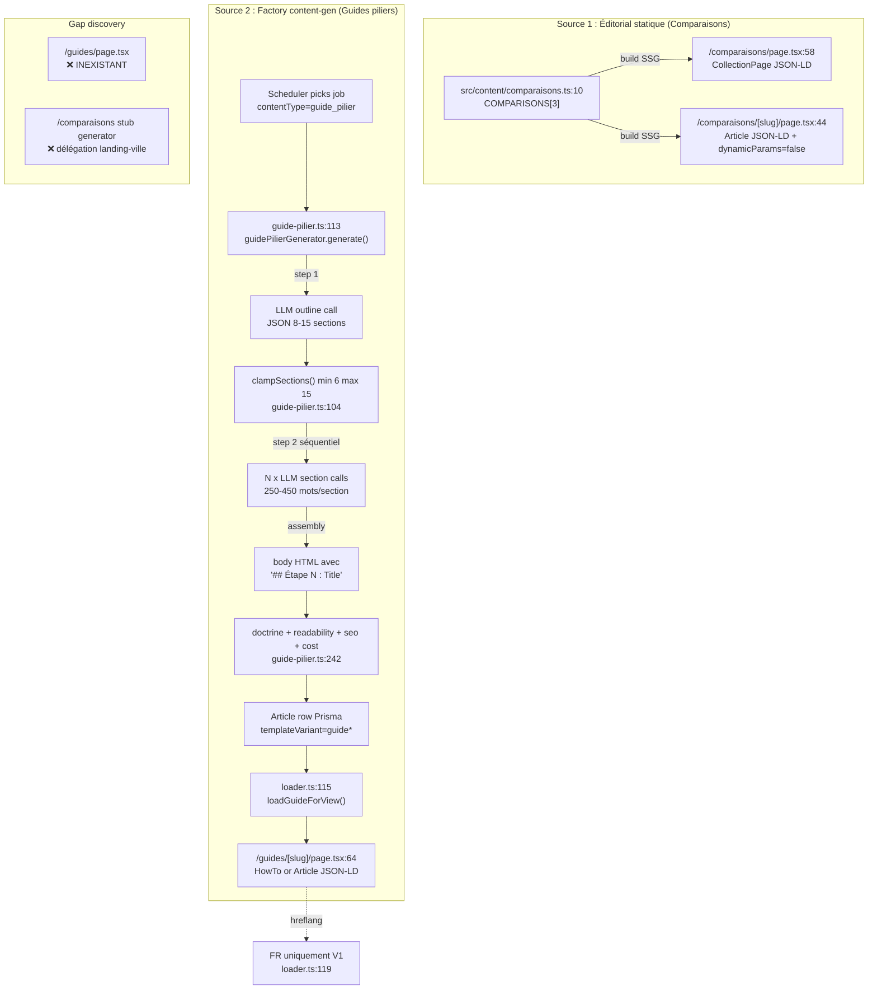

# 18 — TYPE 7 : Comparaisons & Guides piliers

> Score : 52/100 — Status : 🟠 Sprint correctif requis

## 1. Description simple (Will-readable)

Deux familles de contenus longs cohabitent sous ce type :

- **Comparaisons** : 3 articles éditoriaux statiques (`cabinet-ia-vs-saas-generique`, `fine-tuning-vs-rag`, `internalisation-vs-externalisation`). Stockés dans `src/content/comparaisons.ts:10`, pas dans Prisma. Rendu via `/comparaisons` (hub) + `/comparaisons/[slug]` (détail).
- **Guides piliers** : pipeline content-gen 2-étapes (outline LLM → N sections LLM séquentielles). Cible 2000+ mots, 6-15 sections (`guide-pilier.ts:107`). Stockés en DB (`Article` + `ArticleTranslation`), rendus via `/guides/[slug]`.

Le `comparison.ts` générateur est **un stub** : il délègue 100 % à `landing-ville` (`comparison.ts:14`). Aucun gabarit comparatif spécifique (table de décision, scoring, contre-arguments) n'est implémenté côté LLM. Les 3 comparaisons publiées sont éditoriales hardcodées, jamais générées par la factory.

Le `guide-pilier.ts` est un vrai 2-step pipeline propre. La page `/guides` (hub liste) n'existe pas (gap discovery).

## 2. Diagramme Mermaid (flow complet)

## 3. Inputs / Outputs (fichier:ligne)

**Comparaisons (éditorial statique)**

- Input : `src/content/comparaisons.ts:10` `COMPARISONS: ReadonlyArray<Comparison>` (3 entries hardcodés FR+EN).
- Helpers : `getComparison(slug)` `comparaisons.ts:56`, `getAllComparisonSlugs()` `comparaisons.ts:60`.
- Output page liste : `src/app/[locale]/comparaisons/page.tsx:58` (Server Component, `CollectionPage` JSON-LD `page.tsx:65`).
- Output page détail : `src/app/[locale]/comparaisons/[slug]/page.tsx:44` (`Article` JSON-LD `page.tsx:54`, `dynamicParams = false` `page.tsx:22`).
- Sitemap : `src/app/sitemap.ts:623` `buildComparaisonsSitemap` (FR + EN, priority 0.5).
- Routing pathname : `src/i18n/routing.ts:273-274` `/comparaisons` + `/comparaisons/[slug]`.

**Guides piliers (factory content-gen)**

- Generator : `src/server/content-gen/generators/guide-pilier.ts:113` `guidePilierGenerator`.
- Registry : `src/server/content-gen/generators/index.ts:26` (`ContentType` Prisma = `guide_pilier`).
- Sub-prompts : `SYSTEM_PROMPT_OUTLINE` `guide-pilier.ts:47`, `SYSTEM_PROMPT_SECTION` `guide-pilier.ts:73`.
- KB retrieve : `guide-pilier.ts:118` (k=10, audiences=public, types industry_use_case/case_study/methodology/doctrine).
- LLM router : `guide-pilier.ts:153` (step 1) + `guide-pilier.ts:200` (step 2 loop).
- Quality checks : `guide-pilier.ts:243-256` (readability FR, doctrine, SEO score `contentKind: "guide"`).
- Loader : `src/server/content-gen/guides/loader.ts:115` `loadGuideForView()`, FR-only `loader.ts:119`.
- Step parsing heuristique : `loader.ts:66` `parseStepsFromBody()` (regex Étape N / N. / N) ).
- Page détail : `src/app/[locale]/guides/[slug]/page.tsx:64`.
- JSON-LD : `buildHowToJsonLd` ou `buildArticleJsonLd` `page.tsx:75-94`.
- Output Prisma : `Article` + `ArticleTranslation` avec `templateVariant` matché par `GUIDE_TEMPLATE_VARIANT_PATTERNS` `loader.ts:41` (= `["guide", "guide_pilier"]`).
- `faqJson` : `guide-pilier.ts:276` stocke `{ outline, sectionFailures, faq }` pour audit trail + re-gen partielle V2.

## 4. Quality gates

**Comparaisons (statique)** — aucun gate factory (contenu hand-written).

- Pas de doctrine-check programmatique.
- Pas de SEO score.
- Pas de min word count.
- `dynamicParams = false` `[slug]/page.tsx:22` garantit zéro slug invalide (anti-soft-404).

**Guides piliers (factory)**

- Min sections : `clampSections()` throw si < 6 `guide-pilier.ts:108`.
- Max sections : slice à 15 `guide-pilier.ts:110`.
- Word count cible : ≥ 2000 mots (8 sections × 250 min), commentaire `guide-pilier.ts:24` — **non enforcé** par check explicite.
- Doctrine check : `checkDoctrine(bodyText)` `guide-pilier.ts:244` → pénalité -30 pts si fail.
- Readability FR : `computeReadabilityFr` `guide-pilier.ts:243`.
- SEO score : `computeSeoScore({ contentKind: "guide", hasPersonManonJsonLd: true })` `guide-pilier.ts:245`.
- Tier indexation : tier_2 si doctrine OK + qualityScore ≥ 70, sinon tier_3 `guide-pilier.ts:282`.
- Cost cap : pas appelé directement dans le generator (commentaire `guide-pilier.ts:21-22` mentionne `cost-tracker.assertCostCapAvailable()` — **UNKNOWN — requires fact-check**, commande `grep -n "assertCostCapAvailable" src/server/content-gen/`).
- Pénalité section failures : `qualityScore -= min(50, sectionFailures × 10)` `guide-pilier.ts:262`.
- Placeholder soft-fail : `PLACEHOLDER_SECTION_HTML` injecté `guide-pilier.ts:101`.

## 5. Tests existants

- ❌ `**/comparison*.test.ts` : Inexistant (Glob 0 hit).
- ❌ `**/guide-pilier*.test.ts` : Inexistant (Glob 0 hit).
- ❌ `tests/content/comparaisons.test.ts` : **UNKNOWN — requires fact-check**, commande `ls tests/content/`.
- ❌ Tests parity FR/EN sur `COMPARISONS` : aucun (vs `press.test.ts` existe pour `press.ts`).
- ❌ Tests `parseStepsFromBody()` heuristique loader : aucun fichier matched.

## 6. Tests manquants

**Comparaisons**

- Parity FR/EN sur les 3 entries `COMPARISONS` (titre, excerpt, body non vides, longueur cohérente).
- Snapshot `dynamicParams = false` (qu'un slug inconnu retourne 404 propre, pas 500).
- Smoke render JSON-LD `Article` + `CollectionPage` valide JSON.

**Guides piliers**

- Unit `clampSections()` : min 6 throw, max 15 slice, cas limites 5/6/15/16.
- Unit `parseStepsFromBody()` : 3 patterns (Étape N, N. , N) ), edge cases body court < 50 chars, body sans pattern.
- Integration `guidePilierGenerator.generate()` avec router mocked : flux complet outline → 8 sections → assembly → quality.
- Soft-fail section : 1 section throw, vérifier `sectionFailures=1`, `PLACEHOLDER_SECTION_HTML` injecté, `qualityScore -= 10`.
- Loader `loadGuideForView` : FR-only (`locale="en"` → null), status non `published` → null, slug non guide → null.
- JSON-LD HowTo vs Article fallback : si `steps.length >= 2` → HowTo, sinon Article.

## 7. Erreurs / edge cases

**Comparaisons**

- Generator `comparison.ts:14` est un stub (`landingVilleGenerator.generate({ contentType: "comparison" })`). Toute génération factory de type `comparison` produit en réalité un body landing-ville, **non un comparatif** (pas de table, pas de scoring, pas de contre-arguments structurés).
- Aucun `<table>` ni `Comparison`/`ItemList` JSON-LD dédié dans `/comparaisons/[slug]/page.tsx` malgré commentaire generator `comparison.ts:5` « `<table>` obligatoire ».
- Si nouveau slug ajouté à `COMPARISONS` après build, `dynamicParams = false` `[slug]/page.tsx:22` retourne 404 jusqu'au prochain deploy SSG.

**Guides piliers**

- Hub `/guides/page.tsx` **inexistant** (Glob 0 hit). Les détails `/guides/[slug]` sont orphelins côté navigation : aucun maillage interne hub→détail, aucun lien header/footer ne pointe vers `/guides`.
- Aucun pathname `/guides` ni `/guides/[slug]` dans `src/i18n/routing.ts` (grep ligne 234-274 : présents `/presse`, `/stack-ia`, `/comparaisons` mais pas `/guides`).
- Loader heuristique slug `guide-` `loader.ts:49` : tout article DB dont slug commence par `guide-` est traité comme guide, même si `templateVariant != "guide_pilier"`. Collision possible avec articles blog `slug = "guide-pratique-ia"`.
- EN guides désactivés : `loader.ts:119` retourne `null` si `locale !== "fr"`. La page `/en/guides/[slug]` renvoie donc systématiquement `notFound()`, mais reste **pré-rendue SSG** (dynamicParams=true) → gaspillage build EN.
- Pas de sub-sitemap `guides` dans `app/sitemap.ts:229-253` (commentaire `loader.ts:14` : volontaire jusqu'à ce que Batch 3.C livre des guides authentiques).
- Cost cap absent dans generator (commentaire `guide-pilier.ts:21` mentionne le contrat mais aucun appel `assertCostCapAvailable` visible) — risque cost runaway si scheduler boucle.
- `outlineResult.output` peut ne pas contenir d'objet JSON propre → throw `guide-pilier.ts:173` : tout le job échoue, retry BullMQ relance N×coût step 1.
- Sections séquentielles : 8-15 LLM calls bloquants. Latence p99 estimée ~60-120s/guide (vs ~5s/blog standard).
- Placeholder section HTML `guide-pilier.ts:101` visible publiquement si tier passe en publication (le tier_2 ne bloque pas le render, juste l'indexation).

## 8. Status global

- **Comparaisons** : 🟡 Stable mais incomplet. 3 entries éditoriaux, JSON-LD basique `Article` + `CollectionPage`, **aucun Comparison schema dédié**, **aucune `<table>` structurée** dans le body (split par phrase `[slug]/page.tsx:132`). Generator factory est un stub délégué. Pas de tests parity.
- **Guides piliers** : 🟠 Pipeline backend correct mais frontend orphelin. **Hub `/guides` inexistant**, routing pathname absent, EN inutilisable, sitemap absent volontairement. Aucun test unit/integration sur le pipeline 2-step. Pas d'enforcement word count, pas de cost cap, soft-fail placeholder peut polluer publication.
- Score 52/100 : -20 hub guides inexistant, -10 generator comparison stub, -8 tests absents (comparison + guide-pilier), -5 EN guides ghost SSG, -3 Comparison JSON-LD manquant, -2 cost cap UNKNOWN.

**P0 (bloquant indexation)**

1. Créer `/guides/page.tsx` hub liste (lit Prisma `Article` where templateVariant matché + tier_1) sinon les guides factory restent invisibles Googlebot.
2. Implémenter vrai `comparison.ts` generator (table HTML + Comparison JSON-LD ou ItemList structuré) OU le retirer du registry pour éviter falsification.

**P1 (qualité)** 3. Ajouter tests parity `COMPARISONS` (calqués sur `press.test.ts:14`). 4. Tests unit `clampSections` + `parseStepsFromBody`. 5. Enforcer word count ≥ 2000 dans guide-pilier (pénalité qualityScore ou throw). 6. Bloquer EN dans page `/guides/[slug]/page.tsx:69` avant `notFound()` pour éviter SSG ghost.

**P2 (scale)** 7. Sub-sitemap `guides` dès ≥ 10 guides tier_1 publiés. 8. Comparison `<table>` JSON-LD spec si volume de comparaisons > 5.
