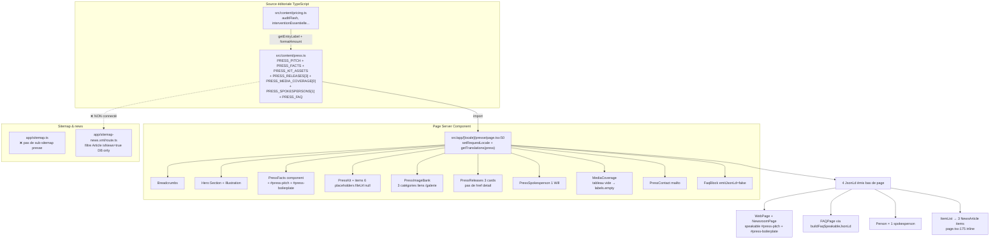

# 19 — TYPE 8 : Pages presse (newsroom)

> Score : 71/100 — Status : 🟡 Solide structurel, gaps sitemap + détail

## 1. Description simple (Will-readable)

Espace presse à page unique `/presse` (FR) / `/press` (EN). Tout est rendu sur la même URL : pitch boilerplate, fact-sheet, kit médias (placeholders Phase 1), communiqués, porte-paroles, couverture médias (vide volontaire), FAQ presse, contact.

Aucune page de détail communiqué (`/presse/[slug]` n'existe pas) : les `PRESS_RELEASES` (3 entries) sont rendues sur la page hub uniquement, sans URL canonique propre par release.

Aucun generator content-gen factory : 100 % éditorial statique TypeScript (`src/content/press.ts:1`). Le `PressImageBank` composant `presse/page.tsx:309` est un lien interne vers `/galerie` (axionia-image-bank skill), pas un embed contenu.

## 2. Diagramme Mermaid (flow complet)

## 3. Inputs / Outputs (fichier:ligne)

**Source données**

- Fixtures FR+EN : `src/content/press.ts:107-447`.
- Pitch derived prix : `pressPitchShort()` `press.ts:23` (consomme `pricing.ts`).
- Release derived prix : `pressReleaseLaunchBody()` `press.ts:34`.
- Helpers : `getPressRelease(slug)` `press.ts:442`, `getAllPressReleaseSlugs()` `press.ts:446`.
- Types : `PressRelease`, `MediaCoverageItem`, `PressSpokesperson`, `PressKitAsset`, `PressFact`, `PressFaqEntry`, `PressPitchLocale` (`press.ts:51-114`).

**Page Server Component**

- Route : `src/app/[locale]/presse/page.tsx` (FR canonical `/presse`, EN `/press` via `routing.pathnames` `routing.ts:234`).
- Metadata builder : `buildProductMetadata` `presse/page.tsx:41` avec `alternates: { fr: "/presse", en: "/press" }`.
- Composants `src/components/sections/` : `PressFacts`, `PressKit`, `PressImageBank`, `PressReleases`, `MediaCoverage`, `PressSpokesperson`, `PressContact`, `FaqBlock`.
- Translations next-intl namespace : `press` (toutes les labels viennent de `getTranslations({ namespace: "press" })` `page.tsx:56`).

**JSON-LD émis**

- `WebPage` + `NewsroomPage` `presse/page.tsx:114` avec `speakable.cssSelector = ["#press-pitch", "#press-boilerplate"]`.
- `Organization` nested via `about` `presse/page.tsx:127` (foundingDate 2024, addressCountry EE, 2 ContactPoint customer service + media inquiry, sameAs LinkedIn).
- `Person` × N spokespersons `presse/page.tsx:155` avec `knowsAbout` + `knowsLanguage`.
- `ItemList` wrapping `NewsArticle` × N releases `presse/page.tsx:175` (chaque item a `@id`, `headline`, `datePublished`, `dateModified`, `inLanguage`, `author`, `publisher`, `image` via `/api/og`).
- `FAQPage` via `buildFaqSpeakableJsonLd` `presse/page.tsx:194`.

**Détail communiqué**

- ❌ `src/app/[locale]/presse/[slug]/page.tsx` : Inexistant — gap identifié (Glob 0 hit).
- Conséquence : les `NewsArticle` JSON-LD `ItemList` exposent un `@id` `#release-<slug>` (fragment ancre) au lieu d'une URL canonique séparée. Google peut quand même indexer (ItemList structurée) mais sans page détail crawlable.

## 4. Quality gates

- Validation TypeScript stricte sur les types (`PressRelease.tag` enum strict 5 values `press.ts:49`).
- Pas de doctrine-check programmatique sur le body release (vs landing-ville).
- Parity FR/EN garantie par test `press.test.ts` (cf. §5).
- Anti-doorway : aucune (pas d'IndexationTier — pages 100 % statiques tier_1_indexable de facto via robots default).
- Anti-SIREN/SIRET/RCS : test `press.test.ts:24` `expect(blob).not.toMatch(/\bSIREN\b|\bSIRET\b|\bRCS\b/i)`.
- Anti-formation : **UNKNOWN — requires fact-check**, commande `grep -n "formation" src/content/press.ts`.
- Press Kit assets en placeholders : `fileUrl: null` `press.ts:186` → bouton télécharger désactivé UI (label `t("kitComingSoon")`).

## 5. Tests existants

- ✅ `src/content/press.test.ts:1` — 9 describes : `pitch`, `facts`, `kit assets`, `releases`, `media coverage`, `spokespersons`, `faq`, `helpers`, `anti-formation` (visible jusqu'à ligne 50 lue).
- Coverage : parity FR/EN par bloc, longueur min strings, unicité IDs, anti-legal-FR (SIREN/SIRET/RCS).
- ❌ Tests sur la page Server Component (render JSON-LD, breadcrumbs, mailto encoding) : aucun trouvé.
- ❌ Tests E2E presse : `grep tests/e2e` retourne 0 file pour `press`/`presse`.
- ❌ Tests sitemap-news consommant `PRESS_RELEASES` : aucun (et pour cause, voir §7).

## 6. Tests manquants

- E2E render `/presse` : présence des 4 `<script type="application/ld+json">` + structure WebPage/NewsroomPage.
- E2E render `/press` (EN) : parity localized strings, alternates hreflang corrects.
- Snapshot JSON-LD `NewsArticle` ItemList contre regression schema.org (champ `image` non vide, `datePublished` ISO).
- Test que `mailto:` encode bien le subject : `presse/page.tsx:220` `encodeURIComponent(t("contactSubject"))`.
- Test que `getAllPressReleaseSlugs` est utilisé quelque part (actuellement seul `getPressRelease` est référencé sans appelant trouvé sauf via grep — orphan ?).
- Test parity `PRESS_MEDIA_COVERAGE` vide ne casse pas le render (déjà géré via `releasesItemList = null` `page.tsx:167`, mais pas testé).

## 7. Erreurs / edge cases

- **Pas de page détail `/presse/[slug]`** : les 3 `PRESS_RELEASES` (`press.ts:273-319`) n'ont pas d'URL crawlable propre. Le composant `PressReleases` consomme `releases` `presse/page.tsx:74` mais les `<Link>` détail manquent (composant render-only based sur cards).
- **Sitemap-news désaligné** : `app/sitemap-news.xml/route.ts:63` filtre `prisma.article.findMany({ where: { isNews: true, ...}})` — il ne lit que la table `Article` DB, **JAMAIS** `PRESS_RELEASES` du fichier `press.ts`. Donc les 3 communiqués éditoriaux **n'apparaissent pas dans Google News** (gap discovery majeur).
- **Sitemap classique** : aucun sub-sitemap presse dans `app/sitemap.ts:229-253` (la liste `staticIds` n'inclut pas `presse`). La page `/presse` elle-même est cependant émise via `buildPagesSitemap` `sitemap.ts:418` (key `/presse` parsée depuis `routing.pathnames`).
- **`xmlns:news` Google News spec** : `sitemap-news.xml/route.ts:116` émet bien `xmlns:news="http://www.google.com/schemas/sitemap-news/0.9"` — conforme. Fenêtre 48h stricte enforced `route.ts:35`.
- **PressRelease typage** : aucun `indexationTier` ni `noindex` — toutes les releases sont implicitement crawlables.
- **`@id` ancres** : `presse/page.tsx:180` `@id: ${pageUrl}#release-${r.slug}` — Google peut indexer les fragments, mais Search Console les groupe sous l'URL parente. Pas d'auto canonical par release.
- **`Person` JSON-LD** : 1 seul spokesperson `press.ts:330` (Will). `knowsAbout` en anglais uniquement `press.ts:335` — devrait être bilingue ou s'adapter au `loc`. Actuellement bug latent : `personsJsonLd` `presse/page.tsx:155` itère mais `knowsAbout: [...p.knowsAbout]` ne change pas selon locale.
- **`MediaCoverage` vide** : `PRESS_MEDIA_COVERAGE = [] as const` `press.ts:325`. Le bloc render passe `items={[]}` + `labels.empty` (anti-fabrication E-E-A-T volontaire `press.ts:323`). Mais la section reste dans la page → un robots peut indexer un H2 « Couverture médias » vide → signal sémantique faible.
- **Press Kit binaires absents** : 6 assets `fileUrl: null`. Le `<a href={k.fileUrl}>` (côté composant `PressKit`) est probablement disabled mais **UNKNOWN — requires fact-check**, commande `grep -n "fileUrl" src/components/sections/PressKit.tsx`.
- **`@/lib/seo.ts buildFaqSpeakableJsonLd`** : utilisé `presse/page.tsx:194` — produit FAQPage avec speakable spec, **UNKNOWN si l'output structure inclut bien `mainEntity` + `acceptedAnswer`**, commande `grep -n "buildFaqSpeakableJsonLd" src/lib/seo.ts`.

## 8. Status global

- ✅ Page hub structurellement riche (8 sections, 4 JSON-LD, speakable spec, parity FR+EN testée).
- ✅ Anti-fabrication E-E-A-T : MediaCoverage vide assumée.
- ✅ Routing alternates corrects `/presse` ↔ `/press` `routing.ts:234`.
- ✅ Test parity FR/EN robuste (`press.test.ts:14` minimum 9 describes).
- ❌ **Pas de page détail `/presse/[slug]`** → releases sans URL canonique.
- ❌ **Sitemap-news ignore `PRESS_RELEASES`** (lit DB Article only) → Google News ne voit pas les 3 communiqués éditoriaux.
- ❌ Press Kit 100 % placeholders Phase 1 (`fileUrl: null`).
- ❌ Person JSON-LD ne traduit pas `knowsAbout` selon locale.
- ❌ Aucun generator factory : tout est éditorial main-tenu manuellement.
- Score 71/100 : -10 sitemap-news désaligné, -8 pas de détail slug, -5 kit placeholders, -3 Person knowsAbout bilingue, -3 MediaCoverage section vide visible.

**P0 (discovery)**

1. Créer `app/[locale]/presse/[slug]/page.tsx` détail communiqué (lit `getPressRelease(slug)`, NewsArticle JSON-LD complet, OG image dédié).
2. Étendre `sitemap-news.xml/route.ts:60` pour merger `PRESS_RELEASES` (filtre fenêtre 48h `publishedAt`) + DB Article isNews. Sans ça, les communiqués éditoriaux ne sortent pas dans Google News.
3. Ajouter sub-sitemap `presse` dans `app/sitemap.ts:229` qui liste les `/presse/[slug]` (release URLs crawlables sitemap classique).

**P1 (qualité)** 4. Fournir les binaires Press Kit (logos SVG, brand-book PDF) et activer `fileUrl`. 5. Traduire `knowsAbout` par locale dans `PressSpokesperson` interface `press.ts:71`. 6. Cacher la section MediaCoverage si vide (au lieu d'afficher labels.empty) OU ajouter ≥ 1 mention réelle.

**P2 (scale)** 7. Generator factory `press_release` (content-gen) si volume > 10 communiqués/an, sinon garder éditorial. 8. Test E2E render JSON-LD presse contre snapshot stable.
