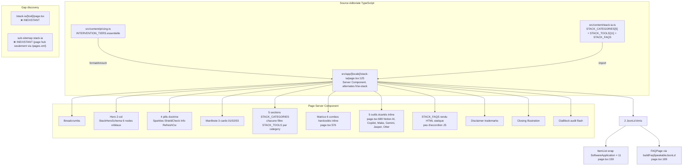

# 20 — TYPE 9 : Stack IA outils

> Score : 78/100 — Status : 🟢 Solide statique, pas de détail par outil

## 1. Description simple (Will-readable)

Page unique `/stack-ia` (FR) / `/ai-stack` (EN) qui présente 11 outils IA opérationnels regroupés en 5 catégories fonctionnelles (penser, produire, capter, construire, orchestrer). 100 % éditorial statique TypeScript (`src/content/stack-ia.ts`), aucun generator content-gen factory.

Aucune page de détail par outil : `/stack-ia/[tool]/page.tsx` **n'existe pas**. Chaque outil est rendu dans une card sur la page hub avec : monogramme, vendor, tagline serif italique, useCase, whenToUse (3-4 bullets), whenToAvoid (1-2 bullets), combo gagnant, lien externe `target="_blank" rel="noreferrer nofollow"`.

Posture éditoriale assumée : aucun partenariat commercial avec les vendors cités (`stack-ia/page.tsx:140` + disclaimer `page.tsx:766`).

## 2. Diagramme Mermaid (flow complet)



## 3. Inputs / Outputs (fichier:ligne)

**Source données**

- Types : `StackAccent`, `StackCategoryId`, `StackCategory`, `StackTool`, `ToolCopy` (`stack-ia.ts:10-53`).
- 5 catégories : `STACK_CATEGORIES` `stack-ia.ts:60-161` (think/produce/capture/build/orchestrate, chacune avec eyebrow/title/titleEm/description FR+EN).
- 11 outils : `STACK_TOOLS` `stack-ia.ts:169+` (Claude, ChatGPT, Copilot 365, Granola, Perplexity, etc. — fact-check par lecture exhaustive non effectuée car > 2000 lignes).
- FAQs : `STACK_FAQS` (référencé `stack-ia/page.tsx:23`, structure UNKNOWN — commande `grep -n "STACK_FAQS" src/content/stack-ia.ts`).
- Doctrine 11 outils / 5 fonctions confirmée par mémoire AxionIA stack-ia 2026-05-07.

**Page Server Component**

- Route : `src/app/[locale]/stack-ia/page.tsx:125`.
- Routing pathname : `src/i18n/routing.ts:271` `/stack-ia` → `{ fr: "/stack-ia", en: "/ai-stack" }`.
- Metadata : `buildProductMetadata` `page.tsx:35` avec `alternates: { fr: "/stack-ia", en: "/ai-stack" }`.
- Pricing derived : `formatAmount(getTierById(INTERVENTION_TIERS, "intervention-essentielle").priceFlat!, ...)` `page.tsx:283` (CTA hero).
- Composants : `StackHeroSchema` `page.tsx:297` (SVG schema 6 nodes orbital), `ToolLogo` `page.tsx:449` (monogramme rendu par id), `Illustration`, `Section`, `Container`, `Cta`, `CtaBlock`, `JsonLd`, `Breadcrumbs`.

**JSON-LD émis**

- `ItemList` wrap `SoftwareApplication` × 11 `page.tsx:159` :
  ```
  { "@type": "ListItem", position, item: {
    "@type": "SoftwareApplication",
    name, applicationCategory: "BusinessApplication",
    url, description: tool[loc].tagline,
    publisher: { "@type": "Organization", name: tool.vendor }
  }}
  ```
- `FAQPage` Speakable via `buildFaqSpeakableJsonLd` `page.tsx:189`.

**Détail par outil**

- ❌ `src/app/[locale]/stack-ia/[tool]/page.tsx` : Inexistant — gap identifié (Glob 0 hit).
- Conséquence : aucun `Product` schema détaillé par outil, aucune URL canonique `/stack-ia/claude`, aucun maillage interne profond.

## 4. Quality gates

- TypeScript strict : `StackAccent` union limitée 4 valeurs, `StackCategoryId` union 5 valeurs.
- Aucune doctrine-check programmatique (content éditorial main-tenu).
- `accentClasses` static map `page.tsx:55` : 4 thèmes Tailwind pré-définis pour JIT (zéro classe dynamique runtime).
- Liens externes : `rel="noreferrer nofollow"` `page.tsx:543` (cohérent : pas de transfert de juice SEO vers vendors).
- Disclaimer trademarks + non-partenariat : `page.tsx:766` (légalement clean).
- Anti-formation : **UNKNOWN — requires fact-check**, commande `grep -n "formation" src/content/stack-ia.ts`.
- Pas de min word count, pas de SEO score programmatique.

## 5. Tests existants

- ❌ `**/stack-ia*test*` : Inexistant (Glob 0 hit).
- ❌ `**/stack*test*` : Inexistant.
- ❌ Tests parity FR+EN sur les 11 STACK_TOOLS (cf. press.test.ts:14 modèle qui existe pour `press.ts`).
- ❌ Tests render Page Server Component : aucun.

## 6. Tests manquants

- Parity FR/EN sur chaque `StackTool` (tagline / useCase / whenToUse / whenToAvoid / combo non vides, longueurs cohérentes).
- Unicité `STACK_TOOLS.map(t => t.id)` (sinon collision sur `accentClasses[cat.accent]` et JSON-LD ItemList).
- Cohérence `STACK_TOOLS[*].category` ∈ `STACK_CATEGORIES.map(c => c.id)` (pas d'outil orphelin sans catégorie rendue).
- Snapshot JSON-LD `ItemList SoftwareApplication × 11` (regression schema.org).
- Anti-formation grep dans stack-ia.ts (banni doctrine).
- Render snapshot tabbar pills doctrine (4 principes labels FR + EN).
- Test `getTierById(INTERVENTION_TIERS, "intervention-essentielle")` ne throw pas (sinon CTA hero crash build).

## 7. Erreurs / edge cases

- **Pas de page détail `/stack-ia/[tool]/page.tsx`** : aucun `Product` schema riche par outil (pricing.org, aggregateRating, image, screenshot), aucune fiche dédiée. Le brief mentionne `Product + comparatifs internes` — actuellement seul `SoftwareApplication` minimal (4 champs) dans ItemList. Pas de `mesh interne vers comparaisons` testable car pas de page détail.
- **Aucun maillage croisé** vers `/comparaisons` depuis la page stack-ia (grep `href="/comparaisons"` dans `stack-ia/page.tsx` : 0 hit visible). Inversement, `/comparaisons` ne référence pas `/stack-ia`.
- **Combos matrice hardcodée inline** : `page.tsx:576` 6 combos `{ fromId, fromName, toId, toName, outputFr, outputEn, accent }` codés en dur dans la page, **pas extraits** de `STACK_TOOLS[*].combo`. Risque drift : si on supprime un tool des `STACK_TOOLS`, le combo correspondant inline ne se mettra pas à jour automatiquement.
- **5 outils écartés inline** `page.tsx:689` : également hardcodés (Notion AI, GitHub Copilot, Make, Gemini, Jasper, Otter) sans structure typée — pas de réutilisation possible.
- **Pas de sub-sitemap stack-ia dédié** dans `app/sitemap.ts:229` (le hub est inclus via `buildPagesSitemap` `sitemap.ts:418` parcourant `routing.pathnames`).
- **EN reste opérationnel** sur cette page (vs guides `/guides/[slug]` qui force FR-only). Mais EN globalement désactivé `AGENTS.md` (proxy 301 EN → FR), donc `/ai-stack` retourne 301 vers `/stack-ia` au runtime.
- **`StackHeroNode` `accent`** : 4 valeurs (terracotta/primary/sage/mocha) cohérentes avec `accentClasses`. Pas de validation runtime que `StackTool.category` retrouve bien un `accent` dans la map (TypeScript strict suffit au build).
- **`tool.url`** : pas de validation HTTPS. Tous les outils listés pointent vers vendors externes — si un vendor change d'URL, lien mort.
- **`ToolLogo` composant** : `page.tsx:449` `<ToolLogo id={tool.id} className="h-7 w-7" />` — assume que chaque `tool.id` a un mapping logo. Si ajout d'un nouveau tool sans logo correspondant, render fallback **UNKNOWN — requires fact-check**, commande `grep -n "id" src/components/sections/ToolLogo.tsx`.
- **`STACK_FAQS` consommation** : 2 emplacements page (FAQ section render `page.tsx:754` + faqJsonLd `page.tsx:189`). Aucun fallback si tableau vide → render `<div>` vide visuellement.

## 8. Status global

- ✅ Page hub structurellement riche et stylée (Hero schema SVG, 5 categories, manifeste 3 cards, matrice combos, outils écartés, FAQ, disclaimer).
- ✅ JSON-LD `ItemList SoftwareApplication` × 11 conformes (publisher Organization, applicationCategory BusinessApplication).
- ✅ FAQPage Speakable JSON-LD via factory `buildFaqSpeakableJsonLd`.
- ✅ Routing alternates corrects `/stack-ia` ↔ `/ai-stack` `routing.ts:271`.
- ✅ Posture éditoriale claire (rel="noreferrer nofollow" + disclaimer + non-partenariat).
- ❌ **Pas de page détail `/stack-ia/[tool]/page.tsx`** → aucun `Product` schema détaillé (le brief audit attendait `Product + comparatifs internes`).
- ❌ **Pas de mesh interne `/stack-ia` ↔ `/comparaisons`** (grep 0 cross-link).
- ❌ **Combos matrice + outils écartés hardcodés inline** dans page.tsx — pas extraits de `STACK_TOOLS`.
- ❌ Aucun test (parity, unicité ids, snapshot JSON-LD).
- ❌ Aucun generator factory : tout éditorial.
- Score 78/100 : -10 pas de page détail tool, -5 pas de mesh `/comparaisons`, -3 combos hardcodés (drift risk), -2 tests absents, -2 fact-check ToolLogo/STACK_FAQS structure.

**P0 (discovery + SEO)**

1. Décision Will : créer ou non `/stack-ia/[tool]/page.tsx` détail par outil avec `Product` JSON-LD enrichi (image, brand, applicationCategory, offers, aggregateRating si possible). Si oui → 11 nouvelles URLs canoniques + sub-sitemap `stack-ia` dédié.
2. Ajouter mesh interne `/stack-ia` ↔ `/comparaisons` (au minimum 1 lien card depuis hub stack-ia vers `/comparaisons/cabinet-ia-vs-saas-generique` — sujet adjacent).

**P1 (qualité)** 3. Tests parity FR/EN sur les 11 outils (calqués sur `press.test.ts`). 4. Test unicité `STACK_TOOLS[*].id` + cohérence `tool.category` ∈ `STACK_CATEGORIES`. 5. Extraire la matrice combos + outils écartés dans `stack-ia.ts` en `STACK_COMBOS` + `STACK_RULED_OUT` typés (anti-drift).

**P2 (scale)** 6. Si volume tool > 20 : auto-générer sections via map sur `STACK_CATEGORIES` + `STACK_TOOLS` (déjà fait `page.tsx:399`, étendre aux combos et exclus). 7. Generator factory `tool_review` si veille trimestrielle devient stable (cf. doctrine « MAJ trimestrielle » `page.tsx:153`).
