# 08 — WORKFLOW, VERSIONNING, AUDIT LOG — Knowledge Base 2026 — Phase A

> Prompt : `_AUDIT/PROMPT-KNOWLEDGE-BASE-2026.md` § Agent 8
> Agent : 8 — Workflow, versionning, audit log
> Date : 2026-05-13
> Statut : DRAFT (Phase A, AUDIT-ONLY — aucun fichier prod modifié)
> Référence : HEAD `main` (commit `95bba36`)
> Reality check amont : `_AUDIT/KNOWLEDGE-BASE-2026/00-REALITY-CHECK.md`

---

## 0. TL;DR

- **Workflow cible** : 7 états `draft → review → approved → scheduled → published → archived → deprecated` + rollback explicite (n+1 = copie d'une n-K).
- **Enum** : recommandation forte = **`KbStatus` dédié** (PAS d'extension de `PublishStatus` global — anti-pollution cross-domaine booking).
- **Versions** : table `KnowledgeVersion` **immutable, append-only** (un row par save), pas d'`updatedAt`, diff calculé à la volée via lib (`jsondiffpatch` recommandé, ~10 KB gz, vs `diff` natif 4 KB gz mais textuel only).
- **Audit log** : **réutilisation directe** de `ActivityLog` existant (lignes 1079-1096 schema.prisma, déjà indexé `(targetType, targetId)`, `action`, `adminUserId`, `createdAt`). Aucune nouvelle table. 21 events `kb.*` listés §6.
- **Rétention versions** : V1 = **toutes versions gardées**, V2+ = compaction LRU (annoncée, **non implémentée** Phase A).
- **Rollback** : action `rollback-version.ts` crée une **nouvelle version n+1 copie d'une version antérieure n-K**, jamais de `DELETE`.
- **Bulk actions audit** : 1 row par entry touchée + 1 row "batch" parent (lien via `changes.batchId`).
- **ADR cible** : **`docs/adr/0021-knowledge-base-unifiee.md`** (convention écrite confirmée reality check §6).

---

## 1. DIAGRAMME D'ÉTATS

```mermaid
stateDiagram-v2
    [*] --> draft : kb.created (EDITOR+)

    draft --> draft : kb.draft.saved (autosave, EDITOR+)
    draft --> review : kb.submitted_for_review (EDITOR+)
    draft --> archived : kb.archived (OWNER, force discard)

    review --> draft : kb.review.rejected (REVIEWER+)
    review --> approved : kb.approved (REVIEWER+ distinct de l'auteur)

    approved --> scheduled : kb.scheduled (EDITOR+, publishAt > now)
    approved --> published : kb.published (EDITOR+, publishAt <= now)
    approved --> draft : kb.review.revoked (REVIEWER+, recall pour edits)

    scheduled --> published : kb.published (cron auto, system trigger)
    scheduled --> approved : kb.unscheduled (EDITOR+, recall)
    scheduled --> archived : kb.archived (OWNER)

    published --> published : kb.updated (EDITOR+, edit en place, ouvre une review side-channel pour version majeure)
    published --> archived : kb.archived (OWNER)
    published --> deprecated : kb.deprecated (OWNER, marque remplacée mais reste lisible)

    deprecated --> archived : kb.archived (OWNER)
    deprecated --> published : kb.restored (OWNER, annule deprecate)

    archived --> draft : kb.restored (OWNER, revient en édition)

    note right of published
      ISR revalidate (3600s) +
      on-demand revalidatePath
      sur les routes /blog,
      /cas-concrets, /centre-aide,
      /faq, /ressources, /glossaire.
    end note

    note right of deprecated
      Reste indexable mais SEO :
      <link rel="canonical"> vers
      replacedById + bandeau UI
      "Article remplacé par X".
    end note
```



### 1.1 Matrice transitions allowed (rôle requis)

| From         | To           | Rôle minimum          | Trigger                  | Side effects obligatoires                                                                                                      |
| ------------ | ------------ | --------------------- | ------------------------ | ------------------------------------------------------------------------------------------------------------------------------ |
| `draft`      | `draft`      | `EDITOR`              | autosave throttled (15s) | `KnowledgeVersion` row, **PAS** d'`ActivityLog` (sinon flood) — exception : log batch `draft.saved.count` quotidien agrégé     |
| `draft`      | `review`     | `EDITOR`              | submit form              | `ActivityLog kb.submitted_for_review`, notify `REVIEWER` via Telegram redacté                                                  |
| `draft`      | `archived`   | `OWNER`               | force discard            | `ActivityLog kb.archived`, snapshot final dans `KnowledgeVersion`                                                              |
| `review`     | `draft`      | `REVIEWER`            | reject avec commentaire  | `ActivityLog kb.review.rejected`, notify author                                                                                |
| `review`     | `approved`   | `REVIEWER` (≠ author) | approve                  | `ActivityLog kb.approved`, gate "REVIEWER must differ from createdById" appliqué côté server action                            |
| `approved`   | `scheduled`  | `EDITOR`              | publishAt > now          | `ActivityLog kb.scheduled`, enqueue BullMQ `kb-publish-scheduled` à `publishAt`                                                |
| `approved`   | `published`  | `EDITOR`              | publishAt ≤ now          | `ActivityLog kb.published`, revalidatePath public hub, IndexNow ping, sitemap-knowledge rebuild                                |
| `approved`   | `draft`      | `REVIEWER`            | revoke pour edits        | `ActivityLog kb.review.revoked`                                                                                                |
| `scheduled`  | `published`  | `system`              | cron BullMQ              | `ActivityLog kb.published` (adminUserId=null, action=`kb.published`, changes.trigger=`cron.scheduled`)                         |
| `scheduled`  | `approved`   | `EDITOR`              | recall avant date        | `ActivityLog kb.unscheduled`                                                                                                   |
| `scheduled`  | `archived`   | `OWNER`               | force                    | `ActivityLog kb.archived` + cancel BullMQ job                                                                                  |
| `published`  | `published`  | `EDITOR`              | edit hot-fix mineur      | `KnowledgeVersion` row, `ActivityLog kb.updated` ; pour version majeure (semver-like ?) ouvrir side-channel review obligatoire |
| `published`  | `archived`   | `OWNER`               | retrait                  | `ActivityLog kb.archived`, revalidatePath, `noindex` + `<meta name="robots" content="noindex">` côté public                    |
| `published`  | `deprecated` | `OWNER`               | replacedById set         | `ActivityLog kb.deprecated`, canonical → replacement                                                                           |
| `deprecated` | `archived`   | `OWNER`               | retrait final            | idem `archived`                                                                                                                |
| `deprecated` | `published`  | `OWNER`               | annule deprecate         | `ActivityLog kb.restored`                                                                                                      |
| `archived`   | `draft`      | `OWNER`               | restore édition          | `ActivityLog kb.restored`                                                                                                      |

### 1.2 États invalides (rejet côté Zod + Server Action)

- `draft` → `published` direct = **REJET** (force passage par `review` → `approved`, sauf flag `Setting.kb.allow_skip_review=true` réservé `OWNER` urgence — désactivé par défaut V1).
- `archived` → `published` direct = **REJET** (re-pass `draft`).
- `review` → `published` direct = **REJET**.
- Auto-approve par l'auteur = **REJET** (`createdById === approvedById` interdit).
- Toute transition non listée matrice §1.1 = **REJET** Zod.

---

## 2. DÉCISION ENUM — `KbStatus` DÉDIÉ vs extension `PublishStatus`

### 2.1 Inventaire — `PublishStatus` actuel (à confirmer agent 1 lignes 205-209)

Le reality check §1.2 indique que `PublishStatus` existe avec valeurs `draft` / `published` / … (à confirmer par lecture précise schema.prisma lignes 205-209). Il est utilisé sur les modèles **non-KB** : probablement `Booking`, `Submission`, `Newsletter` ou `Settings` (à confirmer par grep).

### 2.2 Option A — Étendre `PublishStatus` global

Ajouter `review`, `approved`, `scheduled`, `archived`, `deprecated` à l'enum global.

**Pour** :

- 1 enum unique = moins de duplication conceptuelle.
- Reuse `PublishStatus` côté Newsletter / Booking si besoin futur.

**Contre (DÉCISIF)** :

- **Pollution sémantique** : `review`/`approved`/`deprecated` n'ont aucun sens pour Booking (statuts `pending_payment`, `confirmed`, etc. déjà existants). Mélange domaines.
- **Migration coûteuse** : tous les modèles qui utilisent `PublishStatus` héritent des nouvelles valeurs mortes — risque de bug si UI ne filtre pas.
- **TS narrowing inutile** : un `Booking.publishStatus` ne pourra jamais être `review` mais le compiler le pense possible → checks défensifs partout.
- **Anti-pattern Prisma** : enums globaux cross-domain = code smell connu (cf. doctrine code = SSOT mais SSOT **par domaine**, pas globale).

### 2.3 Option B — `KbStatus` dédié (RECOMMANDATION FORTE)

```prisma
enum KbStatus {
  draft
  review
  approved
  scheduled
  published
  archived
  deprecated

  @@map("kb_status")
}
```

**Pour** :

- Isolation domaine KB (pas de fuite).
- TS narrowing strict : `KnowledgeEntry.status` ne peut JAMAIS contenir un statut booking.
- Migration future indolore (ajouter `under_translation`, `peer_review`, etc. sans toucher Booking).
- Conforme doctrine code = SSOT (SSOT KB ≠ SSOT Booking).
- Aligné `BookingStatus` qui est lui-même booking-only (pattern repo confirmé lignes 1643+).

**Contre** :

- 1 enum de plus dans schema.prisma (38 → 39). Cost = négligeable.

**DÉCISION** : **Option B = `KbStatus` dédié**. ADR 0021 § "Décisions techniques" #2.

---

## 3. MODÈLE `KnowledgeVersion`

### 3.1 Spec Prisma (proposé Phase A — appliqué Sprint KB-1)

```prisma
/// Sprint KB-1 — versioning immutable de KnowledgeEntry.
/// Append-only : un row par save (manuel ou autosave).
/// Pas d'updatedAt — les versions sont des snapshots gelés.
/// Diff entre 2 versions = calculé à la volée via `jsondiffpatch` (cf. doc agent 8).
model KnowledgeVersion {
  id                String              @id @default(uuid()) @db.Uuid
  entryId           String              @map("entry_id") @db.Uuid
  entry             KnowledgeEntry      @relation(fields: [entryId], references: [id], onDelete: Cascade)

  /// Auto-increment per entry (1, 2, 3, …). Géré par trigger Postgres
  /// OU par select `MAX(version) WHERE entryId = ? FOR UPDATE` dans
  /// la server action `save-version.ts` (Sprint KB-4).
  version           Int

  /// Snapshot intégral éditorial + metadata.
  title             String              @db.VarChar(300)
  slug              String              @db.VarChar(160)
  locale            Locale
  bodyHtml          String              @map("body_html") @db.Text
  bodyJson          Json                @map("body_json")
  bodyText          String              @map("body_text") @db.Text

  /// Snapshot metadata (tags, audience, confidentiality, domain,
  /// type, status, publishAt, expiresAt, reviewDueAt, pinned,
  /// featured, replacedById, areasServed, authorId, coverImageId, etc.).
  /// Stocké en Json plutôt qu'éclaté pour limiter le bruit DDL futur.
  metadataSnapshot  Json                @map("metadata_snapshot")

  /// Hash SHA-256 de (bodyJson + metadataSnapshot) pour détection
  /// no-op (skip insert si version N+1 identique à N).
  contentHash       String              @map("content_hash") @db.VarChar(64)

  /// Cause de la version : 'manual.save', 'autosave', 'publish',
  /// 'rollback.from_version_N', 'import.batch', 'translation.added'.
  trigger           String              @db.VarChar(80)

  createdById       String?             @map("created_by_id") @db.Uuid
  createdBy         AdminUser?          @relation("KnowledgeVersionAuthor", fields: [createdById], references: [id], onDelete: SetNull)

  createdAt         DateTime            @default(now()) @map("created_at")

  /// Pas d'updatedAt. C'est immutable.

  @@unique([entryId, version], map: "knowledge_versions_entry_version_unique")
  @@unique([entryId, contentHash], map: "knowledge_versions_dedupe")
  @@index([entryId, createdAt])
  @@index([createdById])
  @@map("knowledge_versions")
}
```

### 3.2 Invariants

1. **Immutable** : aucune action `UPDATE` n'est exposée. Server action `save-version` fait `INSERT` exclusivement.
2. **Append-only** : `version` strictement croissant par entry, gap impossible (séquence locale).
3. **Dedup** : `(entryId, contentHash)` unique → si l'utilisateur sauvegarde 2× le même contenu, l'autosave ne crée pas de doublon (skip silencieux côté server action, retour idempotent).
4. **Pas de FK soft** : `onDelete: Cascade` côté `entryId` (suppression d'entrée = purge versions ; mais l'entrée est rarement deletée — soft-delete via `status='archived'`).
5. **`createdById` nullable** : versions générées par cron/system (publish scheduled) ont `createdById=null` + `trigger='cron.scheduled'`.

### 3.3 Diff — lib comparison

| Lib                  | Taille gz | Type                        | Pour                                                                                         | Contre                                                                                                                                                          |
| -------------------- | --------- | --------------------------- | -------------------------------------------------------------------------------------------- | --------------------------------------------------------------------------------------------------------------------------------------------------------------- |
| `jsondiffpatch` v0.6 | ~10 KB    | structural JSON             | Aligné Tiptap JSON canonique, gère arrays/objects, format HTML diff dispo (`html` extension) | Plus lourd. Side-effect import natif (pas tree-shakable parfait).                                                                                               |
| `diff` (jsdiff) v5   | ~4 KB     | textuel                     | Léger, classique.                                                                            | **Pas adapté à Tiptap JSON** (nœuds nested = diff bruité ligne-par-ligne). Forcerait à diff `bodyText` ou `bodyHtml` stringifié = perte de granularité éditeur. |
| `microdiff`          | ~1 KB     | structural JSON minimaliste | Ultra-léger, structural.                                                                     | Pas de rendu HTML/UI prêt — il faudrait builder UI de diff custom.                                                                                              |
| `deep-diff`          | ~3 KB     | structural                  | Ancien standard.                                                                             | Pas maintenu activement.                                                                                                                                        |

**RECOMMANDATION** : **`jsondiffpatch`** v0.6.

- Justification : Tiptap JSON est un arbre `{type, content, attrs}` — diff structural natif obligatoire. `jsondiffpatch.html(delta)` produit un rendu HTML diff prêt à embed dans l'admin `/connaissances/[id]/versions`.
- Le **diff est calculé à la volée**, jamais persisté. La DB stocke `bodyJson` complet (snapshot), pas de delta. Conséquence : aucune dette si on change de lib diff plus tard.
- Côté bundle : utilisé uniquement en **admin** (`/connaissances/[id]/versions`), chargé en lazy import (`const { diff } = await import('jsondiffpatch')`). Zéro impact bundle public (budget 75 KB gz inchangé).

### 3.4 Anti-patterns versioning (à bannir)

- **Stocker uniquement le delta** : si une version intermédiaire est purgée (compaction V2+), reconstruction impossible. **Toujours stocker le snapshot intégral**, diff = calculé.
- **`UPDATE` sur `knowledge_versions`** : briserait l'immutabilité. Bloqué code + idéalement aussi `REVOKE UPDATE` côté Postgres app user (V2+).
- **Autosave non throttlé** : un row par keystroke → DB obèse. Throttle 15s + dedup `contentHash`.
- **Versionner sans `triggeredBy`** : impossible d'auditer la cause d'une version. `trigger` obligatoire.

---

## 4. POLITIQUE RÉTENTION VERSIONS

### 4.1 V1 — Tout garder

- Aucune purge automatique des `KnowledgeVersion`.
- DB grossit proportionnellement à l'activité éditoriale. Estimation reality check : ~12 articles + ~6 case studies + ~16 FAQ + ~8 help + future blog rythme ~2/semaine = ~150 entries M+12 × ~10 versions/entry moyenne = **~1500 rows / an**.
- À 50 KB JSON moyen par version = **~75 MB / an**. Négligeable sur volume Coolify Postgres (~10 GB libre CPX32). Non-bloquant V1.
- Backup global Coolify déjà en place (mémoire `axionia_session_2026-05-09_sprint_24_1`).

### 4.2 V2+ — Compaction LRU (annoncée, **NON implémentée Phase A**)

**Stratégie cible documentée** (à implémenter Sprint KB-22 ou ultérieur, hors V1) :

1. **Toujours conserver** :
   - Version 1 (création).
   - Toutes les versions `trigger='publish'` (chaque publication = milestone).
   - Les 10 dernières versions par entry.
   - Toute version référencée par un rollback (FK soft via `changes.fromVersionId` dans `ActivityLog`).
2. **Compacter** : versions intermédiaires `trigger='autosave'` âgées de > 90 jours et entre 2 publish milestones.
3. **Job** : BullMQ cron quotidien `kb-version-compact` (dry-run par défaut, output dans Sentry breadcrumbs).
4. **Audit** : chaque purge crée un `ActivityLog kb.version.compacted` avec `changes.compactedVersionIds: [...]`.
5. **Garde-fou** : refuser compaction si `KnowledgeVersion` total < 100 rows / entry (volumétrie négligeable, pas besoin).

**Phase A** : on **n'implémente PAS** la compaction. On documente la politique cible dans cet audit + dans l'ADR 0021. Sprint dédié futur.

---

## 5. ROLLBACK — `rollback-version.ts`

### 5.1 Spec server action (Sprint KB-4, doc Phase A)

```ts
// src/server/actions/knowledge/rollback-version.ts (PROPOSITION — non créé Phase A)

export type RollbackVersionInput = {
  entryId: string;
  toVersion: number; // version cible (n-K)
  reason: string; // commentaire obligatoire (audit trail)
};

export type RollbackVersionResult =
  | { ok: true; newVersion: number }
  | { ok: false; error: "NOT_FOUND" | "FORBIDDEN" | "INVALID_TARGET" };

/**
 * Effectue un rollback en créant une NOUVELLE version (n+1)
 * dont le contenu = snapshot de la version cible (n-K).
 *
 * Invariants :
 * - Aucune DELETE de KnowledgeVersion (immutabilité).
 * - Aucune UPDATE de version existante.
 * - L'entrée KnowledgeEntry est mise à jour pour pointer sur le contenu
 *   restauré (title/slug/bodyHtml/bodyJson/bodyText/metadata).
 * - Status de l'entrée :
 *   * si entry.status='published' → reste 'published' (hot-rollback)
 *   * si entry.status='draft' → reste 'draft'
 *   * sinon → 'draft' (sécurité)
 * - ActivityLog 'kb.version.rolled_back' créé avec changes:
 *   { fromVersion: <currentVersion>, toVersion: <restoredVersion>,
 *     newVersion: <n+1>, reason }
 * - KnowledgeVersion row inséré avec trigger='rollback.from_version_<N>'.
 * - revalidatePath déclenché si entry.status='published'.
 */
```

### 5.2 Règles métier

1. **Rôle minimum** : `EDITOR` pour `draft`, `OWNER` pour `published` (rollback en live = risque).
2. **Target valide** : `toVersion >= 1` ET `toVersion < currentVersion`. Pas de rollback vers le futur.
3. **Reason obligatoire** : champ texte non-vide (≥ 10 char), persisté dans `ActivityLog.changes.reason`.
4. **Snapshot intégral copié** : `bodyHtml`, `bodyJson`, `bodyText`, **et** `metadataSnapshot` (donc tags, audience, etc. — sauf `status` qui reste géré séparément).
5. **Atomique** : transaction Prisma `$transaction([createVersion, updateEntry, createActivityLog])`.
6. **Idempotence faible** : 2 rollbacks identiques consécutifs → 2 versions distinctes (n+1 et n+2, contenu identique). Pas de dedup ici (le `reason` peut différer).

### 5.3 UI admin

- Page `/fr/<adminPrefix>/connaissances/[id]/versions` (Sprint KB-4 / KB-9) : liste paginée des versions avec preview diff sur clic (`jsondiffpatch.html()`).
- Bouton "Restaurer cette version" sur chaque row n-K → modale confirmation + textarea `reason`.
- Bandeau warning si entry.status='published' : "Le rollback affectera immédiatement la page publique. Préférez-vous passer par draft d'abord ?".

---

## 6. AUDIT LOG — `ActivityLog` réutilisé

### 6.1 Réutilisation directe

Modèle existant (`prisma/schema.prisma` lignes 1079-1096) :

```prisma
model ActivityLog {
  id          String     @id @default(uuid()) @db.Uuid
  adminUserId String?    @map("admin_user_id") @db.Uuid
  adminUser   AdminUser? @relation(...)
  action      String     @db.VarChar(120)
  targetType  String?    @map("target_type") @db.VarChar(80)
  targetId    String?    @map("target_id") @db.Uuid
  changes     Json?
  ipAddress   String?    @map("ip_address") @db.VarChar(64)
  userAgent   String?    @map("user_agent") @db.Text
  createdAt   DateTime   @default(now())

  @@index([adminUserId])
  @@index([action])
  @@index([targetType, targetId])
  @@index([createdAt])
}
```

**Verdict** : **PARFAIT TEL QUEL** pour les besoins KB. Aucun champ manquant.

- `action` (VarChar 120) = espace suffisant pour `kb.<noun>.<verb>` (le plus long ci-dessous = `kb.import.batch.rolled_back` = 26 char).
- `targetType` (VarChar 80) = `KnowledgeEntry`, `KnowledgeAsset`, `KnowledgeBatch`, `KnowledgeRelation`, `KnowledgeTranslation` etc. — tient.
- `changes` Json = espace illimité pour `{before, after, batchId, …}`.
- `ipAddress` + `userAgent` = forensic ready.
- Indexes (`targetType, targetId`) + `action` + `adminUserId` + `createdAt` = parfait pour les queries admin "tous les events sur cette entrée" / "tout ce qu'a fait cet admin" / "qui a publié hier" / "tous les `kb.published` du mois".

**Aucune migration nécessaire**. Le module KB consomme `ActivityLog` directement via un helper `src/lib/audit-log.ts` (à créer Sprint KB-4 s'il n'existe pas déjà — un helper similaire existe probablement pour Booking, à confirmer).

### 6.2 Liste exhaustive events `kb.*` (Sprint KB-4 + KB-9 + KB-19)

| Event `action`                | targetType       | Déclencheur                                       | changes.\* clés                                                                                                                     |
| ----------------------------- | ---------------- | ------------------------------------------------- | ----------------------------------------------------------------------------------------------------------------------------------- |
| `kb.created`                  | `KnowledgeEntry` | server action `create-entry.ts`                   | `{title, slug, type, locale, createdBy}`                                                                                            |
| `kb.updated`                  | `KnowledgeEntry` | server action `update-entry.ts` (champs non-body) | `{before: {…}, after: {…}, diffFields: [...]}`                                                                                      |
| `kb.draft.saved`              | `KnowledgeEntry` | autosave throttled 15s                            | `{versionId, contentHash}` — **agrégé / batché** côté worker pour éviter flood (1 row toutes les 5min ou à chaque sortie d'éditeur) |
| `kb.submitted_for_review`     | `KnowledgeEntry` | bouton "Demander review"                          | `{reviewerAssignedId?, dueAt?}`                                                                                                     |
| `kb.review.assigned`          | `KnowledgeEntry` | OWNER assigne reviewer                            | `{reviewerId, assignedById}`                                                                                                        |
| `kb.review.rejected`          | `KnowledgeEntry` | reviewer reject                                   | `{reviewerId, comment}`                                                                                                             |
| `kb.approved`                 | `KnowledgeEntry` | reviewer approve                                  | `{reviewerId, comment?}`                                                                                                            |
| `kb.review.revoked`           | `KnowledgeEntry` | reviewer recall                                   | `{reviewerId, reason}`                                                                                                              |
| `kb.scheduled`                | `KnowledgeEntry` | publish différé                                   | `{publishAt, jobId}` (BullMQ id)                                                                                                    |
| `kb.unscheduled`              | `KnowledgeEntry` | recall avant publishAt                            | `{jobId, reason?}`                                                                                                                  |
| `kb.published`                | `KnowledgeEntry` | publish (manuel ou cron)                          | `{trigger: 'manual' \| 'cron.scheduled', publishedAt, revalidatedPaths: [...]}`                                                     |
| `kb.unpublished`              | `KnowledgeEntry` | retour vers `draft` post-publish                  | `{reason?}`                                                                                                                         |
| `kb.archived`                 | `KnowledgeEntry` | archive                                           | `{previousStatus, reason?}`                                                                                                         |
| `kb.deprecated`               | `KnowledgeEntry` | marque deprecated                                 | `{replacedById?}`                                                                                                                   |
| `kb.restored`                 | `KnowledgeEntry` | restore depuis archive ou deprecated              | `{previousStatus}`                                                                                                                  |
| `kb.deleted`                  | `KnowledgeEntry` | **hard delete** (réservé `OWNER`, exception RGPD) | `{title, slug, snapshotForRecovery: bool}`                                                                                          |
| `kb.relation.added`           | `KnowledgeEntry` | ajout `KnowledgeRelation`                         | `{relationId, toEntryId, kind}`                                                                                                     |
| `kb.relation.removed`         | `KnowledgeEntry` | suppression `KnowledgeRelation`                   | `{relationId, toEntryId, kind}`                                                                                                     |
| `kb.translation.added`        | `KnowledgeEntry` | nouvelle locale                                   | `{locale, translationId}`                                                                                                           |
| `kb.translation.updated`      | `KnowledgeEntry` | màj traduction existante                          | `{locale, translationId, diffFields: [...]}`                                                                                        |
| `kb.version.rolled_back`      | `KnowledgeEntry` | rollback action                                   | `{fromVersion, toVersion, newVersion, reason}`                                                                                      |
| `kb.import.batch.created`     | `KnowledgeBatch` | import bulk                                       | `{source: 'csv' \| 'notion' \| 'legacy_glossary', entriesCreated, entriesUpdated, dryRun: bool}`                                    |
| `kb.import.batch.rolled_back` | `KnowledgeBatch` | rollback batch                                    | `{batchId, entriesAffected}`                                                                                                        |
| `kb.asset.uploaded`           | `KnowledgeAsset` | upload media                                      | `{mimeType, bytes, hash, usageEntryIds: [...]}`                                                                                     |
| `kb.asset.deleted`            | `KnowledgeAsset` | suppression asset                                 | `{wasReferenced: bool}`                                                                                                             |
| `kb.feedback.received`        | `KnowledgeEntry` | vote `helpful` public                             | `{vote: 'up' \| 'down', anonymized: true}` — pas d'IP brute                                                                         |

**Total** : 26 events documentés (les 21 obligatoires du prompt + 5 utiles dérivés).

### 6.3 Spec payload `changes` — schéma canonique

```ts
// src/lib/audit-log.ts (PROPOSITION — non créé Phase A)

export type ActivityLogPayload<TBefore = unknown, TAfter = unknown> = {
  targetType:
    | "KnowledgeEntry"
    | "KnowledgeAsset"
    | "KnowledgeBatch"
    | "KnowledgeRelation"
    | "KnowledgeTranslation";
  targetId: string; // UUID
  action: KbActivityAction; // union des `kb.*` listés §6.2
  changes?: {
    before?: TBefore; // état avant (UPDATE only)
    after?: TAfter; // état après (UPDATE only)
    diffFields?: string[]; // liste des champs modifiés (lisibilité admin)
    reason?: string; // raison textuelle (rollback, archive…)
    batchId?: string; // pour bulk actions (cf. §6.4)
    [k: string]: unknown; // extension libre
  };
  adminUserId?: string | null; // null si system/cron
  ipAddress?: string; // depuis req.headers
  userAgent?: string; // idem
};
```

**Règles** :

1. `before` / `after` **PII-redacted** via helper `redactPiiForAudit()` (réutilise `src/lib/pii-redaction.ts`) — l'audit log lui-même ne doit jamais contenir d'email/téléphone/IBAN en clair. Pattern ADR 0010 Telegram déjà éprouvé (mémoire `axionia_session_2026-05-09_sprint_24_1`).
2. `before` / `after` **trim** à 8 KB max par snapshot (sinon DB obèse) — pour les éditions volumineuses, persister seulement `diffFields` + `versionId` (lookup `KnowledgeVersion` pour récup intégral).
3. `ipAddress` truncatée à `/24` IPv4 ou `/64` IPv6 (RGPD : anonymisation partielle, conforme Sprint 24 RGPD).
4. `userAgent` brut (non sensible) — utile forensic.

### 6.4 Bulk actions — pattern parent + enfants

Pour les opérations affectant N entrées en une fois (import batch, bulk archive, bulk republish post-template-change), on émet :

1. **1 row "batch parent"** : `targetType='KnowledgeBatch'`, `targetId=<batchUuid>`, `action='kb.import.batch.created'` (ou autre), `changes.entriesAffected: N`, `changes.summary: {created: 12, updated: 3, skipped: 1}`.
2. **N rows "entry enfants"** : `targetType='KnowledgeEntry'`, `targetId=<entryId>`, `action='kb.created'` (ou `kb.updated`/`kb.archived`/…), `changes.batchId=<batchUuid>` (lien parent).

**Query admin "détail d'un batch"** :

```sql
SELECT *
FROM activity_logs
WHERE changes->>'batchId' = '<batchUuid>'
   OR (target_type = 'KnowledgeBatch' AND target_id = '<batchUuid>')
ORDER BY created_at ASC;
```

**Index** : pas d'index sur `changes->>'batchId'` en V1 (volumétrie faible). Si > 10K logs batch / an en V2+, ajouter `CREATE INDEX activity_logs_batch_id_idx ON activity_logs ((changes->>'batchId'))` via migration dédiée. Documenté ADR 0021 §"Optimisations différées".

**Rollback d'un batch** : action dédiée `kb.import.batch.rolled_back` qui :

- Reverse logique sur chaque entry (depending on what was done : créées → archived, updated → rollback-version, archived → restored).
- Émet 1 log batch parent + N enfants `kb.version.rolled_back` (ou `kb.archived`/`kb.restored` selon cas).
- Si rollback partiel (échec sur certaines entries), `changes.failures: [{entryId, error}, …]`.

### 6.5 Cas particuliers

- **Autosave flood** : 1 user × 50 saves × 5 entries × 220 jours = 55 000 rows / an pour 1 seul user. **Trop**. Décision : `kb.draft.saved` NE crée PAS un row par save individuel. À la place :
  - Le `KnowledgeVersion` row existe (versioning toujours fin).
  - L'`ActivityLog` enregistre **un seul row agrégé** par "session d'édition" (= silence > 5 min entre 2 saves), avec `changes.saveCount: N`, `changes.firstVersionId`, `changes.lastVersionId`.
  - Implémenté côté server action `save-draft.ts` via flag `Setting.kb.activity_log_aggregate_drafts=true` (default).
- **System events** (cron publish scheduled) : `adminUserId=null`, `changes.trigger='cron.scheduled'`, `userAgent='system/bullmq-worker'`. Filtrable côté admin par `WHERE admin_user_id IS NULL`.
- **Public events** (kb_helpful vote) : `adminUserId=null`, `targetType='KnowledgeEntry'`, `action='kb.feedback.received'`, `ipAddress` (anonymisée /24), `userAgent` (anonymisé via UA-Parser, on garde seulement OS + browser family). **Sous consent cookie** uniquement (RGPD).

---

## 7. ADR CIBLE — `docs/adr/0021-knowledge-base-unifiee.md`

### 7.1 Localisation confirmée

Convention écrite du repo : `axionia/docs/adr/` (reality check §6). 20 ADRs déjà présents (0001 → 0020). Prochain numéro = **0021**.

**Phase A produit** : `_AUDIT/KNOWLEDGE-BASE-2026/ADR-DRAFT.md` (sandbox audit).
**Phase B promeut** : `docs/adr/0021-knowledge-base-unifiee.md` (ADR officiel mergeable).

### 7.2 Structure ADR 0021 — section dédiée Agent 8

L'ADR 0021 contiendra une section dédiée Agent 8 avec :

1. **Décision 1** : `KbStatus` enum dédié (recommandation §2.3 ci-dessus).
2. **Décision 2** : `KnowledgeVersion` table immutable append-only (spec §3.1).
3. **Décision 3** : `jsondiffpatch` retenu pour diff à la volée (justification §3.3).
4. **Décision 4** : `ActivityLog` existant réutilisé sans modification de schéma (§6.1).
5. **Décision 5** : 26 events `kb.*` (§6.2) — liste exhaustive figée pour V1.
6. **Décision 6** : autosave **NE crée pas** de row `ActivityLog` individuel mais un agrégat de session (§6.5).
7. **Décision 7** : compaction LRU différée à V2+ (§4.2) — politique documentée, non implémentée V1.
8. **Décision 8** : rollback = nouvelle version n+1, jamais DELETE (§5.1).
9. **Décision 9** : bulk actions = 1 batch parent + N enfants liés via `changes.batchId` (§6.4).

### 7.3 Anti-patterns explicites listés dans l'ADR

- Étendre `PublishStatus` global (cf. §2.2).
- Stocker uniquement le delta dans `KnowledgeVersion` (cf. §3.4).
- Auto-approve par l'auteur (gate code obligatoire).
- Publier sans review (sauf flag `Setting` urgence OWNER, off par défaut).
- Hard delete sans `kb.deleted` log + snapshot recovery.
- Logs `ActivityLog` contenant PII brut (toujours redact via `pii-redaction.ts`).
- Index manquant sur `(targetType, targetId)` (déjà présent — vérifier non-régression).

---

## 8. ANTI-PATTERNS (récap consolidé)

### 8.1 Workflow

- ❌ Transition `draft → published` direct (skip review) sans flag `OWNER` explicit + log audit `kb.review.bypassed`.
- ❌ Reviewer === Author. Gate code via `if (entry.createdById === ctx.adminUserId) throw FORBIDDEN`.
- ❌ Re-publish silencieux après edit majeur sans repasser par review.
- ❌ Status changé hors server action (manipulation directe Prisma client) — bloquer via wrapper `transitionTo(entry, newStatus, actor)`.
- ❌ Pas de cron de réveil scheduled → entrées coincées en `scheduled` éternel. BullMQ delayed job avec retry obligatoire.

### 8.2 Versioning

- ❌ Stocker uniquement un diff dans `KnowledgeVersion` (reconstruction impossible si gap).
- ❌ `UPDATE` sur un row `KnowledgeVersion` (briserait immutabilité).
- ❌ Pas de dedup `contentHash` → DB obèse par autosave répétitif.
- ❌ `version` non-monotonic (gaps tolérés). Trigger Postgres ou `MAX() FOR UPDATE` obligatoire.
- ❌ Diff lib chargée en bundle public (charger en `await import()` lazy admin only).
- ❌ Rollback qui DELETE versions postérieures (rétention immutable obligatoire).

### 8.3 Audit log

- ❌ Oublier audit log sur actions de masse (bulk archive sans batch parent + enfants).
- ❌ Logger PII brut (email, téléphone, IBAN, contenu utilisateur) — passer par `pii-redaction.ts`.
- ❌ `changes.before/after` non trimés → rows ActivityLog de plusieurs MB.
- ❌ `adminUserId` requis NOT NULL → empêche cron/system events. Garder nullable.
- ❌ IP en clair non tronquée (RGPD).
- ❌ Pas d'index sur `action` → query admin "tous les `kb.published`" devient table scan. Index déjà présent (vérifier non-régression).
- ❌ Logger 1 row par keystroke autosave (cf. §6.5 — agrégat session).

### 8.4 RBAC

- ❌ Hardcoder les rôles dans la server action (`if role === 'admin' …`). Centraliser dans `src/lib/knowledge/rbac.ts` (Sprint KB-19 / Agent 9).
- ❌ Trust côté client (boutons UI cachés mais action non gated). **Tous les gates côté server action**.
- ❌ Forgetting `2FA enforced` check sur `OWNER` actions destructives (`kb.deleted`, `kb.import.batch.rolled_back`).

---

## 9. STOP & ASK ouverts (à trancher avant Sprint KB-4)

> Mode AUDIT-ONLY : aucun de ces points n'est tranché Phase A. Tous listés pour décision Will avant Phase B.

### 9.1 Workflow

1. **Skip review en urgence** : ajouter le flag `Setting.kb.allow_skip_review_for_owner` (default `false`) ? OU bannir absolument toute publication sans review V1 ? Recommandation : flag présent mais default OFF.
2. **Review side-channel sur `published`** : un edit hot-fix mineur `published → published` (cf. matrice §1.1) — faut-il forcer un repassage `published → review → approved → published` pour les edits majeurs ? Comment qualifier "majeur" ? Threshold sur `diffFields.length` ? Threshold sur `bodyText` word-count delta > 20 % ? Recommandation : seuil 20 % word-count, sinon hot-fix toléré avec log `kb.updated.minor`.
3. **`scheduled` vers le passé** : un user fixe `publishAt` à hier accidentellement → on auto-publish (recommandation) ou on rejette (`publishAt >= now() + 5min` minimum) ?
4. **`deprecated` requiert-il un `replacedById` obligatoire** ? Recommandation : OUI pour SEO (canonical), avec exception override `Setting.kb.allow_orphan_deprecation=false`.

### 9.2 Versioning

5. **Format version** : entier monotonique simple `1, 2, 3, …` (recommandation) ou versioning sémantique `1.0, 1.1, 2.0` selon `diffFields` ? Recommandation : entier (KISS V1, sémantique différable V2+).
6. **Throttle autosave** : 15s (recommandation) ou 30s ? Compromis frappe rapide / charge DB.
7. **`MAX(version) FOR UPDATE`** vs trigger Postgres pour increment ? Recommandation : `FOR UPDATE` en server action (plus simple à debugger, pas de DDL custom).
8. **Diff UI rendering** : montrer side-by-side OU inline GitHub-style ? Recommandation : inline V1 (lib `jsondiffpatch.html()` produit ce format directement), side-by-side différable.

### 9.3 Audit log

9. **Aggregate autosave logs** : 1 row par session d'édition (recommandation §6.5) — valider la définition "session" = silence > 5 min. OK ou ajuster ?
10. **PII redaction profondeur** : redacter aussi `changes.before/after` si le `bodyText` contient un email client cité dans un case study ? Recommandation : OUI — `redactPiiForAudit()` appliqué récursif sur tout `changes`.
11. **Public feedback (`kb.feedback.received`)** : conserver ce log dans `ActivityLog` ou dans une table dédiée `KnowledgeFeedback` ? Volume potentiel élevé (1 vote / lecteur). **Recommandation forte : table dédiée `KnowledgeFeedback`** + rollup quotidien dans `ActivityLog` (agrégat 1 row / entry / jour `kb.feedback.daily_summary`).
12. **Retention `ActivityLog`** : `retention-purge` cron existant (Sprint 24) purge-t-il déjà `ActivityLog` ? Politique RGPD = 13 mois par défaut. Confirmer ou étendre.
13. **Log côté system events** : `adminUserId=null` + filtre dashboard admin — Will veut-il un user technique `system@axion-ia.com` plutôt que NULL ? Recommandation : garder NULL + filtre UI "Système" pour clarté.

### 9.4 ADR / docs

14. **Promotion ADR** : `_AUDIT/KNOWLEDGE-BASE-2026/ADR-DRAFT.md` → `docs/adr/0021-knowledge-base-unifiee.md` au moment du merge Phase B, ou attendre fin Sprint KB-1 ? Recommandation : promouvoir dès ouverture de `feature/kb-foundations` pour figer les décisions.
15. **Numéro ADR** : `0021` confirmé (reality check §6) ?

### 9.5 Bulk actions

16. **Seuil "bulk"** : à partir de combien d'entries on émet un `KnowledgeBatch` parent ? Recommandation : N ≥ 2 (donc même un "archive 2 entries" émet un batch parent — uniformité).
17. **Rollback batch partiel** : si 1/12 entries échoue rollback, on rollback les 11 autres et on logue `changes.failures` (recommandation) ou on abort tout ?

---

## 10. CONTRAT D'INTERFACE — helpers à créer Sprint KB-4

Tous les noms ci-dessous sont **proposés Phase A**, non créés.

```ts
// src/lib/knowledge/state-machine.ts
export const KB_TRANSITIONS_ALLOWED: Record<KbStatus, KbStatus[]>;
export function canTransition(from: KbStatus, to: KbStatus, role: AdminRole): boolean;
export function transitionTo(
  entry: KnowledgeEntry,
  to: KbStatus,
  ctx: AdminContext,
): Promise<KnowledgeEntry>;

// src/lib/knowledge/versioning.ts
export function computeContentHash(bodyJson: JsonValue, metadata: JsonValue): string;
export function diffVersions(a: KnowledgeVersion, b: KnowledgeVersion): JsonValue; // jsondiffpatch.diff
export function renderDiffHtml(delta: JsonValue): string; // jsondiffpatch.html

// src/lib/audit-log.ts (extension du helper existant booking ou création neuve)
export async function logKbActivity(payload: ActivityLogPayload): Promise<void>;
export async function logKbBatchActivity(batch: {
  action;
  targetType;
  entries;
}): Promise<{ batchId }>;

// src/server/actions/knowledge/save-version.ts
export async function saveVersionAction(input: SaveVersionInput): Promise<SaveVersionResult>;

// src/server/actions/knowledge/rollback-version.ts
export async function rollbackVersionAction(
  input: RollbackVersionInput,
): Promise<RollbackVersionResult>;

// src/server/actions/knowledge/transition-status.ts
export async function transitionStatusAction(
  input: TransitionStatusInput,
): Promise<TransitionStatusResult>;
```

---

## 11. PROCHAINES ÉTAPES (Phase B — hors AUDIT-ONLY)

1. ADR `docs/adr/0021-knowledge-base-unifiee.md` créé, sections §7.2 + §7.3 intégrées.
2. Sprint KB-1 ajoute `enum KbStatus` + table `KnowledgeVersion` à `prisma/schema.prisma`.
3. Sprint KB-4 implémente `src/lib/knowledge/state-machine.ts` + `versioning.ts` + server actions (`save-version`, `rollback-version`, `transition-status`).
4. Sprint KB-9 implémente l'UI admin `/connaissances/[id]/versions` + bouton rollback.
5. Sprint KB-19 (RGPD) implémente `pii-redaction.ts` ∘ `logKbActivity` en couche obligatoire + ajoute purge `kb.*` events au cron `retention-purge`.
6. Sprint KB-22 (V2+, hors V1) implémente la compaction LRU décrite §4.2.

---

**Fin Agent 8 — Workflow / Versionning / Audit log. Aucune modification code Phase A. AUDIT-ONLY respecté.**
